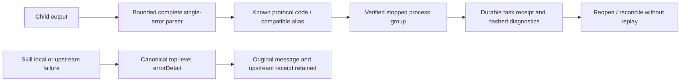

# ArtCraft public error consumption matrix

Status: candidate implementation and partial AC-CP-001 acceptance, 2026-10-09. Task 1.3 remains open.

The child-output parser and persisted task error previously preserved only `capability_missing`; the other defined public errors became `native_execution_failed`. The independent skill wrapper also returned legacy `budget_exceeded` as its public error code. These behaviors contradicted the existing public protocol.

The protocol now exports its eight known public codes. Bounded complete single-error output can report these codes or the legacy budget alias. The ledger retains the recognized public code after verified process-group shutdown, normalizes the alias to `budget_exhausted`, and stores only the diagnostic code and output digests. Other domain codes remain diagnostics under `native_execution_failed`. Conflicting, duplicate-field, excessive, incomplete or unknown reports retain the existing refusal rules.

| Report | Public code | Evidence |
|---|---|---|
| runtime_missing | runtime_missing | Four-domain process matrix |
| capability_missing | capability_missing | Four-domain process matrix |
| revision_conflict | revision_conflict | Four-domain process matrix |
| idempotency_conflict | idempotency_conflict | Four-domain process matrix |
| outcome_unknown | outcome_unknown | Process matrix plus four actual native post-save cases |
| artifact_invalid | artifact_invalid | Four-domain process matrix |
| budget_exhausted | budget_exhausted | Four-domain process matrix |
| authorization_required | authorization_required | Four-domain process matrix |
| budget_exceeded | budget_exhausted | Legacy code retained in diagnostics; 30 local and 10 upstream skill alias cases |

The 36 real OS child-process cases failed 32 times before the fix, with the four existing capability cases passing. After the fix, these and existing diagnostic tests pass 48/48. This tests four plugin identities through Art's parser; the child workers are controlled fixtures, not the professional applications. Each checks attempt and runtime identity, empty outputs, verified stop, released ownership under the existing terminal rule, unchanged budget/events on reconcile, database reopen, no replay and no private text persistence. The change does not make a failed outcome successful, grant retries or alter allocation/refund policy.

Ten independent skill directories run 120 wrapper cases: three legacy budget dimensions and nine upstream code variants each. The original error string and complete upstream receipt are preserved, the public detail is canonical, and no task identity or retry is invented. Forty alias subcases failed before the fix; all now pass.

Four additional cases use actual pinned FilmCraft, EffectCraft, PhotoCraft and VectorCraft native binaries. A controlled hook corrupts the reply after actual save. The candidate Art core reports `outcome_unknown`, preserves and reopens the original stage, blocks the downstream consumer and retains the original attempt and budget without replay. The runtime modules are explicitly loaded from current source: the old retained installation receipt's runtime132 label is provenance only. This is not fixed-release runtime132 or runtime134 acceptance.

Full source regression: Node 627 passed / 25 conditional skips (652 total); skills Python 162 passed / 52 skips (214 total). Evidence: [machine record](evidence/public-error-matrix-candidate-20261009.json).

Fixed runtime/source/plugin publication and installed revalidation remain pending. The four domain protocol references still pin owner109, before later budget normative additions; this matrix does not upgrade those external references or prove complete consumer compatibility. Task 1.3 and full V1 remain open.
