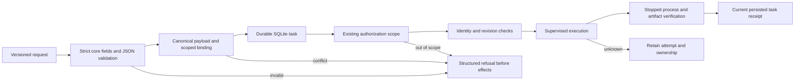

# ArtCraft public task protocol implementation audit

Historical implementation audit for fixed122. Current task1.3 qualifies in fixed140; see [current qualification](ArtCraft-Task-Protocol-Qualification-Architecture.md). Remaining statements below describe the historical checkpoint.

The OpenSpec change `establish-v1-plugin` remains authoritative. This audit completes implementation tasks **1.1 and 1.2**; boundary acceptance **1.3 remains open**. No runtime, skill snapshot, protocol schema or release identity was changed in this audit.

## Request, execution and response

Registration returns `planned` with a null attempt; acquiring execution creates `running` and an attempt. `review_ready` requires technical verification. It does not represent creative approval or `completed`. Workflow node summaries expose the current ledger receipt rather than constructing a second task identity. Reuse reopens the original task. Pre-registration rejection cannot manufacture a task receipt.

## Requirement coverage

| Requirement or scenario | Current evidence | Boundary |
| :--- | :--- | :--- |
| AC-CP-001-P: fields, versioned payload, runtime identity and response | 28 field/binding tests; persisted receipt and native Vector creation | Schema acceptance does not authorize a native operation |
| AC-CP-001-N: scoped idempotency | SQLite reopen/process tests and 16 field mutation cases | A changed task ID alone retains the original task identity |
| AC-CP-001-V: unsupported version/core fields | Strict protocol tests and own-property corpus | Domain extensions remain inside versioned payload |
| AC-CP-001-A: existing authorization | Runner/workflow authorization tests and installed native scope rejection | An authorization string alone does not bypass the trusted authorization callback |
| AC-CP-001-OWN-FIELDS | 39 own-property cases against the fixed current runtime | Allowed domain JSON data is retained |
| AC-CP-001-WORKFLOW-RECEIPT | Two reproduced behavior failures on fixed historical source; current workflow tests and installed single-skill receipt/reuse | Fixture process evidence and creative native evidence are recorded separately |
| Budget error code and refusal preservation | Current shared-budget tests and two installed native revision refusals | Public `budget_exhausted` preserves the legacy message; refused revisions allocate nothing |
| Fixed protocol consumers | Four pinned domain references; 16 owner-file hashes checked | Their task specification predates the canonical budget error addition |

## Verification

The baseline is immutable Art plugin107 source `caa4317a68d9e122deb6f3aaf3790b5afa5a8fd9`. Current receipt tests fail twice because `taskReceipt` and `errorDetail` are absent, rather than because of imports or unavailable dependencies. The fixed runtime122 archive has SHA-256 `dee84246361abde40086c64a4a7032c41bae91c4402ebbc28bcb8d25c61e0232`; all 29 runtime source/schema files match the current checkout. Against these archive bytes, 107 existing protocol tests and 28 new field/binding tests pass without skips.

Current full runtime regression: **275 tests, 255 pass, 20 conditional skips, zero failures**. Two separately copied fixed plugin execute skill snapshots use empty public runtime directories and native Vector: receipt/reuse/scope refusal passes in 32.384 seconds; revision-budget refusal and complete ledger/native preservation passes in 36.828 seconds. Installed/source skill hashes match, and skill content remains unchanged after use. This is copied single-skill public first use; it is not a new Codex installation or a generic Skills CLI installation.

[Machine-readable evidence](evidence/public-task-implementation-audit-20261008.json) binds source, tests, archives, logs and scenario results. Detailed logs remain in the workspace QA directory `artifacts/craft-art-public-task-audit-20261008`.

## Remaining acceptance

Task **1.3** requires compatibility evidence for the complete current normative contract. Four selected domain releases pin owner109: both protocol schemas and the artifact specification still match current bytes, but the task specification differs because canonical budget rejection requirements were added later. Fixed reference identity alone cannot establish consumer behavior for the added requirement. ArtCraft must verify the consumer mapping for these error responses and a complete public response/error matrix before closing 1.3. Other domain repositories remain read-only in this task.

No new release is needed for unchanged runtime/skill bytes. New field coverage is an audit of existing behavior and passed on first execution; it is not presented as a new implementation RED/GREEN cycle. Full V1, generic Skills CLI installation, host model dispatch, GUI, creative approval and other target platforms retain their separate open gates.
