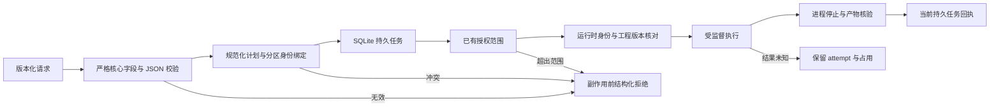

# ArtCraft 公共任务协议实施审计

规格事实源仍为 OpenSpec 变更 `establish-v1-plugin`。本次审计完成实施任务 **1.1、1.2**；真实边界验收 **1.3 保持开放**。本次未改变运行时、技能快照、协议 schema 或发行身份。

## 请求、执行与响应

登记返回 `planned`，attempt 为 null；取得执行权后进入 `running` 并创建 attempt。`review_ready` 需要技术核验，不代表创作通过或 `completed`。工作流节点摘要公开当前账本回执，不构造第二套任务身份。复用读取原任务；登记前拒绝不得伪造任务回执。

## 需求覆盖

| 需求或场景 | 当前证据 | 边界 |
| :--- | :--- | :--- |
| AC-CP-001-P：字段、版本化 payload、运行时身份与响应 | 28 项字段／绑定测试；持久回执与真实 Vector 创作 | schema 通过不能授权原生操作 |
| AC-CP-001-N：分区幂等 | SQLite 重开／跨进程测试与 16 种字段变更 | 仅改变 taskId 时保持原任务身份 |
| AC-CP-001-V：不支持的版本／核心字段 | 严格协议测试与自有字段语料 | 领域扩展留在版本化 payload 内 |
| AC-CP-001-A：已有授权 | 执行器／工作流授权测试与安装后原生范围拒绝 | 授权字符串不能绕过可信授权回调 |
| AC-CP-001-OWN-FIELDS | 在当前固定运行时上执行 39 项自有字段测试 | 合法领域 JSON 数据保留 |
| AC-CP-001-WORKFLOW-RECEIPT | 固定历史源码复现两项行为失败；当前工作流测试与安装后单技能回执／复用 | fixture 进程与专业原生软件证据分别记录 |
| 预算错误码与拒绝保全 | 当前共享预算测试与两次安装后原生修订拒绝 | 公开 `budget_exhausted` 保留兼容消息；拒绝不分配新额度 |
| 固定协议消费者 | 四领域锁定引用；16 项所有者文件摘要核对 | 其任务规格早于预算规范错误码增量 |

## 验证

基线为不可变 Art 插件107源码 `caa4317a68d9e122deb6f3aaf3790b5afa5a8fd9`。当前回执测试在基线上两项失败，原因分别是缺少 `taskReceipt`、`errorDetail`，不是导入或环境失败。固定运行时122归档 SHA-256 为 `dee84246361abde40086c64a4a7032c41bae91c4402ebbc28bcb8d25c61e0232`；全部 29 个运行时源码／schema 文件与当前检出相同。对这些归档字节执行的既有协议测试 107 项及新增字段／绑定测试 28 项全部通过，无跳过。

当前运行时完整回归：**275 项，255 通过，20 条件跳过，零失败**。两份独立复制的固定插件 execute 技能快照各自使用空公开运行时目录与真实 Vector：回执／复用／范围拒绝在 32.384 秒通过；修订预算拒绝和完整账本／原生文件保全在 36.828 秒通过。安装技能与独立技能源摘要一致，使用后技能内容保持不变。本次是复制单技能的公开首用，不是重新执行 Codex 插件安装或通用 Skills CLI 安装。

[机器证据](evidence/public-task-implementation-audit-20261008.json) 绑定源码、测试、归档、日志与场景结果。完整日志位于工作区 QA 目录 `artifacts/craft-art-public-task-audit-20261008`。

## 剩余验收

任务 **1.3** 需要完整当前规范合同的兼容性证据。选定四领域发行锁定所有者109：两个协议 schema 与素材规格仍与当前字节相同，但任务规格在后续增加了预算规范拒绝要求。固定引用身份不能单独证明消费者对新增要求的行为。ArtCraft 仍需验证这些错误响应的消费者映射与完整公开响应／错误矩阵，之后才能完成 1.3。本任务保持其他领域仓库只读。

运行时／技能字节未变化，无需新发行。新增字段测试审计既有行为，首次执行即通过，不虚构新的实施红绿循环。完整 V1、通用 Skills CLI 安装、宿主模型调度、GUI、创作验收及其他目标平台继续保留各自未完成门禁。
