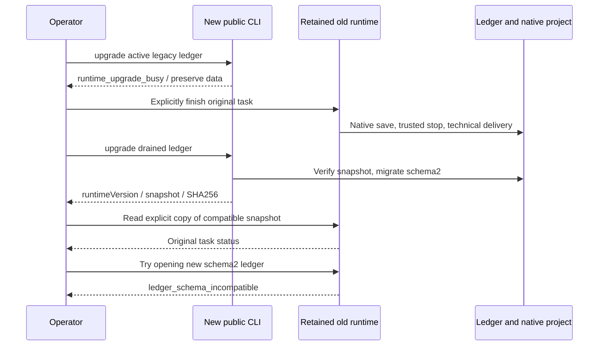

# ArtCraft public ledger upgrade candidate architecture

Candidate runtime129 adds `upgrade --database ABS`. Published identities remain plugin128/source100/runtime128; existing release assets do not contain this new command.

The entry requires an existing absolute database path and never creates a missing ledger. Active schema1 tasks, residual leases and untrusted executions refuse migration. After draining, it returns `state: completed`, `runtimeVersion`, `schemaVersion: 2`, `migrated: true` and the snapshot path, schema version and SHA256. Current schema2 returns `migrated: false` and `snapshot: null`. The verified mode0600 snapshot behavior from runtime128 is retained; future schemas refuse downgrade.

The retained immutable dev.0 schema1 implementation executed real EffectCraft0.2.0 native creation/save/reopen in an isolated directory. The candidate rejects active migration, accepts the drained ledger, preserves full snapshot schema/data, refuses old-runtime downgrade, supports explicit copied-snapshot compatibility and does not replay on repetition. Native bytes and retained implementation hashes remain unchanged. This is candidate/source-runtime evidence, not an installed129 host release.

Two RED tests failed because the command was absent; all20 targeted tests passed. Full runtime:322 tests,300 passed/22 conditional skips. Native integration:1 passed. Its first driver omitted the required artifact record; the native process exited0 with its saved project preserved. The corrected adapter passed in a fresh directory, retaining the initial failure log. [Evidence](evidence/upgrade-entry-candidate-20261009.json). Existing mode, pinned-schema drift and bridge-boundary tests are recorded separately.

Task4.4 is complete. Tasks4.5/4.6 remain open for fixed distribution, installed-copy upgrades and the complete AC-RT-002 scenario matrix. Thirteen numbered tasks remain; full V1 is incomplete. Snapshot preservation does not implement automatic project rollback or replay. Source100 skill bytes and existing release assets are unchanged; OpenSpec is not archived.
