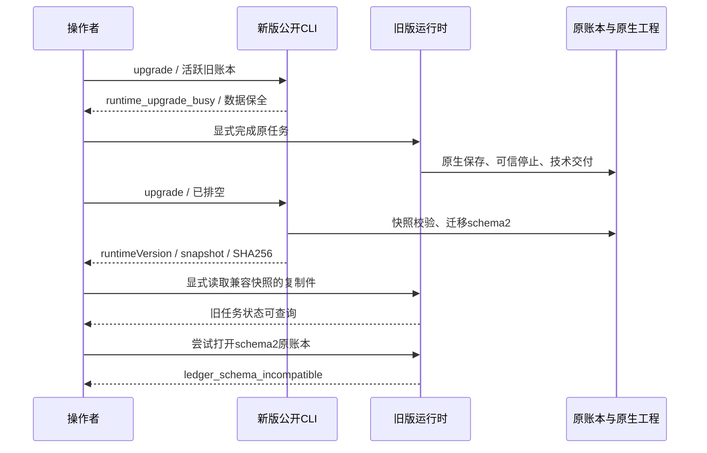

# ArtCraft 公开账本升级候选架构

源码候选 runtime129 补充 `upgrade --database ABS`。公开发行仍是插件128／技能源100／runtime128；当前发行包不包含此新增命令。

入口要求已有绝对路径账本；不创建缺失文件。旧schema1活跃任务、残留租约或未可信停止执行被拒绝；排空后返回 `state: completed`、当前 `runtimeVersion`、`schemaVersion: 2`、`migrated: true` 以及 `snapshot` 的路径、schema版本与SHA256。已有schema2返回 `migrated: false`、`snapshot: null`。内部迁移与权限0600快照校验沿用runtime128实现；高版本schema拒绝降级。

保留固定标签dev.0的真实schema1实现，在隔离目录执行EffectCraft0.2.0原生创建、保存、重开。新入口验证拒绝活跃任务、旧版排空、逐表完整快照、新schema拒绝旧版、显式复制快照兼容读取、重复调用不迁移不重放，原生工程和旧实现摘要保持不变。此为候选与保留源运行时验证，不冒充从插件宿主安装的129发行。

TDD：两项红灯均为公开命令缺失；目标20项通过。完整运行时322项：300通过／22条件跳过；真实原生专项1项通过。首次原生测试遗漏必需的产物记录，原生进程退出0且工程保全，补齐测试适配器后在新目录通过，保留原失败日志。[证据](evidence/upgrade-entry-candidate-20261009.json)。既有模式、锁定schema漂移与bridge边界目标回归单独记录。

任务4.4完成；4.5／4.6继续开放，尚需固定发行接入、安装副本升级及全部AC-RT-002场景矩阵。剩余13项编号任务，完整V1未完成。快照保全不提供自动工程回滚或自动重放；原账本与新账本不得互相强制降级。本次不改技能源100的技能字节、不覆盖发行资产、不归档OpenSpec。
