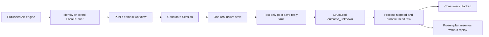

# ArtCraft public-workflow protocol-fault architecture

> Date: 2026-10-07. Status: bounded candidate verification passed; new fixed domain releases and installed acceptance are pending.

## 1. Problem and ownership

Complete-command access and public creation workflows must share trustworthy reply validation. Immutable Vector source dev.13 lets malformed tool content reach an unhandled decoder error. The shared Session fix belongs to independent domain skills. Art retains public domain adapters and adds no Jianying adapter.

## 2. Execution and durable state

Native outcome uncertainty and Art task state are distinct. The public workflow reports outcome_unknown. Art records failed only after stopping the process; replaying the frozen plan preserves task, attempt and budget without starting another native save.

## 3. Evidence and test boundary

`test/native_protocol_workflow.test.ts` imports the actual publicly downloaded dev.73 engine, runner, ledger and trusted publicSkillFactory. Candidate skill and native executable hashes are bound separately. The test-only adapter extends launcher-file identities and uses a loader hook plus transparent stdio proxy. Neither published engine code nor native binaries are patched.

Six faults cover malformed JSON, scalar response, missing result, conflicting result/error, nonfinite JSON and invalid tool content. Assertions bind structured stdout to diagnostics, one real save, blocked/unregistered consumers, preserved attempt/budget, no replay and immutable skill/runtime files. [Candidate evidence](evidence/public-workflow-session-candidate-20261007.json) also contains 24 native complete-command fault cases across four domains and four healthy public workflows. Domain default regression passes 262 with 90 opt-in skips; Art passes 172 with 17 skips. Explicit native cases are recorded separately.

## 4. Recovery limitations

Public creation workflows clean failed staging directories. The proxy copies the newly saved project solely to prove the side effect happened and the file can reopen in the native CLI. This does not prove product preservation or recovery of failed staged projects. Complete-command journal/failure preservation is a separate verified contract.

## 5. Delivery and specification

Domain CM-001 task 8.9 and Art AC-RT-002 task 4.7 stay open. Fixed domain source releases, vendored plugins, a new Art distribution and actual installed-copy tests remain required. Current Art dev.75's earlier pinned domain clients were not replaced by this test. Exhaustive 2639-command, GUI, model-dispatch and full V1 acceptance remain separate.

Fixed installed domain copies now close bounded domain8.9; Art4.7 stays open. The published engine and installed Vector client pass six faults: [evidence](evidence/codex-public-workflow-session-first-use-20261007.json). Art dev.75 still bundles earlier sources; the updated distribution needs its own fixed mixed-task acceptance.
