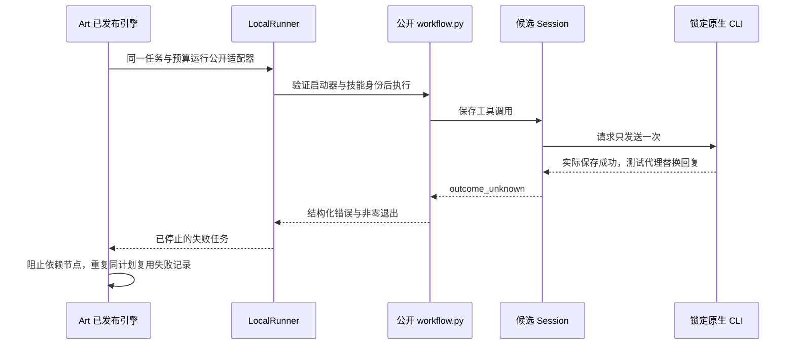

# ArtCraft 公开工作流协议故障架构

> 日期：2026-10-07。状态：候选验证通过，新的固定领域发行与实际安装门禁未完成。

## 1. 问题与边界

四领域完整命令目录已经有同会话入口；公开创作工作流也必须通过一致的协议检查。旧 Vector 源 dev.13 对工具 `content: [null]` 缺少结构检查，公开工作流未返回结构化未知结果。共享 Session 修复属于独立技能源，Art 继续使用公开适配器，不新增剪映适配。

## 2. 流程与状态

领域结果未知与 Art 任务状态是两层：本测试领域输出 `outcome_unknown`；Art 在进程确实停止后持久化任务 `failed`，不把未知原生副作用当作可重试失败。重复同一冻结计划保持 task／attempt 和预算，未再次启动领域或执行保存。

## 3. 可复现验证与信任边界

`test/native_protocol_workflow.test.ts` 从已公开下载的 runtime dev.73 导入实际 WorkflowEngine、LocalRunner、TaskLedger 和 publicSkillFactory。候选 Vector 技能及原生二进制分别绑定真实摘要。测试适配器只扩充启动器文件清单并加载 `test/fixtures/workflow_protocol_injection.py`；该钩子加载真实客户端，再通过 stdio 代理替换实际成功保存后的回复，不修改产品入口或发布物。

六类异常为畸形 JSON、非对象、缺少结果、结果与错误冲突、非有限数、工具内容结构错误。每例要求实际保存一次、公开输出仅含结构化 error、诊断绑定 stdout 摘要、下游未注册、原 task／attempt／预算保持、重复计划不重放、二进制及技能摘要不变。

[候选证据](evidence/public-workflow-session-candidate-20261007.json)还包括四领域 24 个完整命令入口故障案例、四个健康公开工作流、默认领域 262 通过／90 跳过，以及 Art 默认 172 通过／17 跳过。显式六例与默认跳过分别记录。

## 4. 保留与恢复限制

公开创建工作流会清理失败暂存目录。测试代理额外复制刚保存的原生工程并用真实 CLI 重开，这证明副作用已发生和工程可读，**不证明产品会保留失败工程**。完整命令入口自己的 failure／journal 保留合同单独验证。不得用测试副本代替产品恢复方案。

## 5. 规格与交付

领域 `CM-001` 任务 8.9 和 Art `AC-RT-002` 任务 4.7 保持开放。下一步固定发布新的领域技能源、vendor 插件快照、构建新版本 Art 分发包，再在实际安装副本验证。当前 Art dev.75 分发包的旧领域客户端未被本测试替换；不能将候选结果标为该版本已修复。全量 2639 命令、GUI、模型派发、完整 V1 仍单独验收。

固定领域安装副本现已复验，领域8.9有界门禁关闭；Art4.7保持开放。已发布引擎与安装后Vector客户端的六类异常通过，[证据](evidence/codex-public-workflow-session-first-use-20261007.json)。这不替换Art dev.75内置的旧领域包；新Art分发仍待固定发行和实际混合任务验收。

## 新领域协议客户端组合分发（dev.77候选）

组合运行时dev.76、Art技能源dev.52固定Film技能源dev.15和Effect／Photo／Vector技能源dev.14。全部48项领域技能客户端纳入完整源ZIP锁，不修改旧标签、旧分发锁或旧安装目录。十个Art技能从冻结提交的干净归档分别复制到独立目录、空运行时公开安装Node＋Art＋四领域CLI，用时452.970秒；版本、帮助与技能文件摘要均核对。

单个Art返工技能冷安装后完成1920×1080／24fps／5秒混合项目：120帧实际解码、四段RGBA、Logo替换及依赖更新、独立节点复用、帧损坏恢复和五子工程移动包验证通过，用时227.331秒。实际公开下载的运行时通过四领域公开适配器24个真实保存后异常案例；原生保存只执行一次，公开回复为outcome_unknown，下游不注册，同一计划不重放，task／attempt／预算与输入保持，捕获的工程另起原生会话重开。

测试代理捕获暂存工程不证明产品保留失败工程。候选源验收也不替代固定插件安装与摘要核验。[版本绑定候选证据](evidence/art-updated-domain-distribution-candidate-20261007.json)。任务4.7保持开放，直到新固定插件首用验证完成；完整命令／GUI／模型与V1保持单独门禁。

## 固定发行安装验收

固定插件 dev.77／技能源 dev.52／运行时 dev.76 已通过实际安装首用：Codex 发现五插件58项技能、零加载错误；十个 Art 技能分别从空运行时公开安装全部四领域（累计461.66秒）；1080p／24 fps／五秒混合创作、Logo 返工、坏帧恢复及五子工程移动包通过（215.727秒）；四领域公开工作流24个保存后响应故障均停止且不重放。全部58项安装身份、四领域完整源包、原生CLI和Node摘要保全，四项固定提交CI通过。测试检查器曾产生一个字节码缓存，清理后重新核验固定身份并补跑第十项。仅关闭OpenSpec4.7分发升级子门禁；全量2639命令／GUI／修订、通用Skills CLI、模型和完整V1仍开放。测试代理捕获工程不证明产品保留失败暂存工程。[版本绑定证据](evidence/codex-art77-domain-distribution-first-use-20261007.json)。
