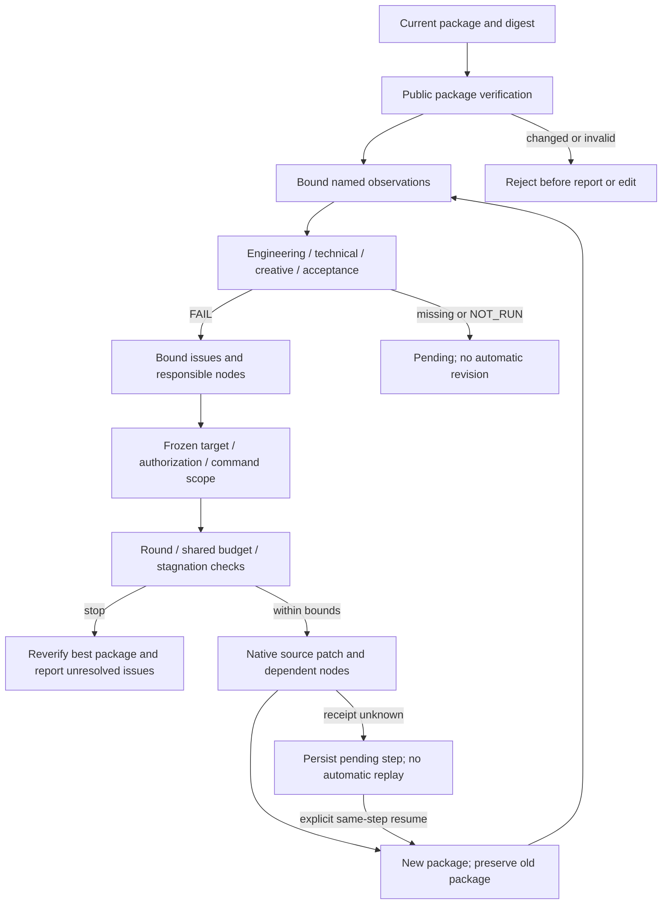

# ArtCraft quality evidence and bounded revision

This document verifies the mechanisms specified by **AC-QA-001** and **AC-QA-002**, completing existing tasks **8.1–8.6**. It does not assert aesthetic quality, evaluator authentication or human acceptance of the test media. The original OpenSpec requirements remain unchanged.

## Implementation boundary

The independent `artcraft-skills` package owns `review.py` and `revision.py`. Each of ten skills has its own complete scripts; the plugin vendors immutable source94. The earlier plan location `src/evaluation/` was provisional. Review and revision use public package/workflow entry points, not a second runtime evaluator or private domain imports. Current runtime122, source94 and plugin122 remain unchanged.

## State and evidence rules

Review verifies the current package before reading evaluator observations. Reports bind package/plan digests, owner, authorization, node, asset ID/version/digest and runtime identity. Locators and evaluator declarations are recorded; their semantic truth is not automatically authenticated. Observations are copied into a portable sidecar. Engineering integrity, technical, creative and acceptance states remain separate. Any failure blocks the overall acceptance decision; missing coverage or `NOT_RUN` remains pending. Human acceptance declarations cannot be supplied by model/tool actors. Review does not modify the package, ledger or task state.

Revision requires a verified package and review, a hash-bound policy and explicit patches. The policy freezes target, owner, authorization, allowed commands, maximum rounds and stagnation threshold. Only failed nodes and their transitive consumers may change; patches bind current native source projects. Untargeted nodes retain identity and output bytes. Shared budget remains inherited. A changed policy/target cannot reuse the cycle. Unknown results retain the pending step and round; only explicit same-step recovery proceeds. Stop receipts reverify the best package and keep unresolved issues bound to their own package/review identity.

## Scenario evidence

| Scenario | Current evidence |
| :--- | :--- |
| AC-QA-001-P | Seven review unit tests plus actual installed review skill recording and cold moved verification |
| AC-QA-001-N | Positive creative/acceptance unit declarations cannot override technical FAIL; actual Film movie fully decodes, a corrupted copy fails ffmpeg and public review/package verification without creating a report |
| AC-QA-001-RECORD | Current native Vector review, portable sidecar, stale asset and tampered observation refusal; unit cases cover old package/plan/owner, missing proof, nonhuman acceptance, locator and symlink boundaries |
| AC-QA-002-P | Ten revision unit tests plus actual installed revise skill native Logo/poster patch and unrelated task reuse |
| AC-QA-002-N | Three real native cases stop for stagnation, round limit or inherited budget; original native files/packages remain unchanged, best package reverified, unresolved issues preserved |
| AC-QA-002-STEP | Real test controller process group killed after native review readiness; repeated call remains unknown without new task/charge, explicit resume keeps identity, changed policy/target refused |

The review baseline before the feature is immutable source commit `f932b2ddfaf3df74f9da0f96aa4d76e0c10bc9b6`: seven current cases cannot load the missing product review entry. This establishes feature absence, not a reproduced technical-score regression. Before-revision baseline `493dd7c80da1d3eece4e0f62b5aa8bd4cbfe3ba6` fails ten cases because the product revision.py entry is absent. Revision baseline `f4e21ebbb3c0db4c99f7389c8febbaac3ec6b8b0` passes eight cases but fails two because stop receipts lack `unresolvedIssues`. Current implementations pass all 17 cases. The added technical-dominance assertion passed on its first execution; no new production fix is claimed.

Actual installed, independently copied cold first-use times: review record/move **49.077s**, native revision/three stop policies **97.931s**, Film decode/review rejection **28.513s**. These were fresh public runtime directories using the existing Python and system-only native PATH. Skill trees match immutable source94/plugin122 and the actual Codex-installed trees before and after use. All three are CLI mechanism acceptance with declared creative test observations; no new host/model session or generic Skills CLI installation was performed.

The first Film fixture attempted `file.newColorMatte` in the semantic workflow and was rejected as `unsupported_command`. This was a test-route mistake, not a new product RED. The corrected test uses the supported existing PNG material-import workflow; the failed attempt and its logs remain retained.

[Machine-readable evidence](evidence/quality-mechanisms-acceptance-20261008.json) binds the current code, test files, installed identities, native receipts and logs. Detailed QA files are retained in `artifacts/craft-art-quality-acceptance-20261008`.

## Remaining project gates

Completing the evidence-separation and bounded-revision mechanisms does not complete project-wide V1. Automatic patch generation, automatic aesthetic judgement, authenticated evaluators, actual human acceptance, host model dispatch, GUI and other target platforms have no new proof here. Public protocol task1.3, remaining domain capability tasks and other existing OpenSpec tasks retain their own gates. No schema, runtime, installed skill or immutable release tag was changed for this audit.
