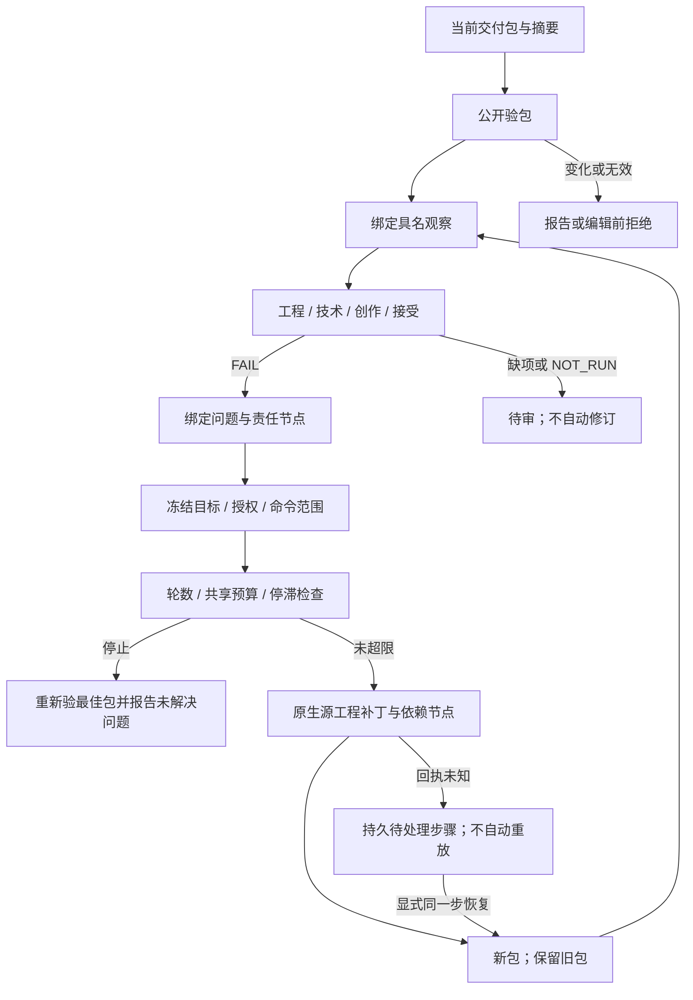

# ArtCraft 质量证据与受限修订

本文验收 **AC-QA-001、AC-QA-002** 的机制，完成既有任务 **8.1–8.6**。不宣称测试媒体的审美质量、评价者身份认证或实际人工接受。原 OpenSpec 需求保持不变。

## 实现边界

独立 `artcraft-skills` 包持有 `review.py`、`revision.py`。十个技能各自携带完整脚本，插件引用不可变源94。早期计划的 `src/evaluation/` 是预设位置；当前审阅与修订通过公开验包／工作流入口实现，不另建运行时评价器，不导入领域私有代码。当前运行时122、源94及插件122均未改变。

## 状态与证据规则

审阅在读取评价者观察前核验当前包。报告绑定包／计划摘要、所有者、授权、节点、资产 ID／版本／摘要和运行时身份。定位信息和评价者声明被记录，其语义真实性不自动认证。观察复制到可迁移的包外记录。工程完整性、技术、创作与接受状态独立；任何失败阻止总体接受，缺项或 `NOT_RUN` 保持待审。模型／工具不能声明人工接受。审阅不修改包、账本或任务状态。

修订要求已核验的包与审阅、摘要绑定策略及明确补丁。策略冻结目标、所有者、授权、允许命令、最大轮数和停滞阈值。只有失败节点及传递消费者可以变化；补丁绑定当前原生源工程。非目标节点保留身份与产物字节。共享预算继承。改变策略／目标不能复用旧循环；未知结果保留待处理步骤和轮次，只允许显式同一步恢复。停止回执重新验证最佳包，并将未解决问题绑定到其自己的包／审阅身份。

## 场景证据

| 场景 | 当前证据 |
| :--- | :--- |
| AC-QA-001-P | 七项审阅单元测试；实际安装审阅技能记录与迁移后冷运行时核验 |
| AC-QA-001-N | 单元测试中正面创作／接受声明不能覆盖技术 FAIL；真实 Film 成片完整解码，损坏副本同时被 ffmpeg 与公开审阅／验包拒绝，不生成审阅报告 |
| AC-QA-001-RECORD | 当前原生 Vector 审阅、可迁移包外记录、过期资产与篡改观察拒绝；单元测试覆盖旧包／计划／所有者、缺失证据、非人工接受、定位与符号链接 |
| AC-QA-002-P | 十项修订单元测试；实际安装 revise 技能原生 Logo／海报修改与无关任务复用 |
| AC-QA-002-N | 三项真实原生用例分别因停滞、轮次或继承预算停止；原工程／原包字节不变，最佳包重验并保留未解决问题 |
| AC-QA-002-STEP | 在原生工作流技术就绪后实际终止测试控制进程组；重复调用保持未知、不新建任务或扣额，显式恢复保留身份，改变策略／目标被拒绝 |

审阅功能前基线是不可变源提交 `f932b2ddfaf3df74f9da0f96aa4d76e0c10bc9b6`：七项当前用例因产品审阅入口不存在而无法加载。这证明功能缺失，不冒充复现技术评分回归。修订功能前基线 `493dd7c80da1d3eece4e0f62b5aa8bd4cbfe3ba6` 十项因产品 revision.py 入口缺失而失败。修订基线 `f4e21ebbb3c0db4c99f7389c8febbaac3ec6b8b0` 八项通过、两项因停止回执缺少 `unresolvedIssues` 失败。当前实现 17 项全部通过。新增技术优先断言首次执行即通过，不宣称本轮修复了生产代码。

实际安装技能分别复制后的冷首用耗时：审阅记录／迁移 **49.077 秒**，原生返工／三种停止策略 **97.931 秒**，Film 解码／审阅拒绝 **28.513 秒**。使用全新公开运行时目录、已有 Python 和仅系统原生 PATH。技能完整目录与不可变源94／插件122及实际 Codex 安装目录匹配，使用后保持不变。三项验收针对 CLI 机制，创作评价为声明的测试观察；未新建宿主模型会话或执行通用 Skills CLI 安装。

第一版 Film 夹具在语义工作流中尝试 `file.newColorMatte`，被 `unsupported_command` 拒绝。这是测试路由选择错误，不是新的产品红灯。修正后使用已支持的 PNG 素材导入工作流；失败尝试与日志仍保留。

[机器证据](evidence/quality-mechanisms-acceptance-20261008.json) 绑定当前代码、测试文件、安装身份、原生回执与日志。完整 QA 文件保留在 `artifacts/craft-art-quality-acceptance-20261008`。

## 项目剩余门禁

证据分离与受限修订机制验收不代表整个 V1 完成。本次没有新增自动补丁生成、自动审美评判、评价者身份认证、真实人工接受、宿主模型调度、GUI 或其他平台证据。公共协议任务1.3、其余领域能力及既有 OpenSpec 任务保留各自门禁。本次没有改变 schema、运行时、安装技能或不可变发行标签。
