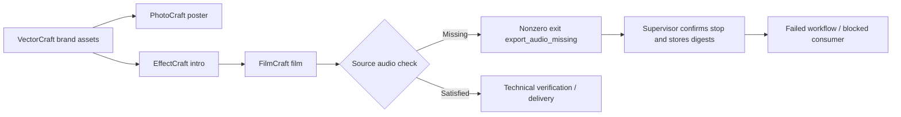

# ArtCraft required source audio failure propagation

## Contract and scope

OpenSpec `AC-TX-002-AUDIO` is authoritative. When FilmCraft requires audio, an automatically generated silent AAC stream cannot replace an actual timeline audio source. ArtCraft consumes the domain check instead of treating an exported stream as sufficient completion evidence. Jianying remains independently owned by its existing plugin.

## Execution architecture

## Technical design

The closed code set in `native_diagnostics.ts` includes `export_audio_missing`. Parsing accepts only complete, bounded, single-field JSON. Unknown suffixes, conflicting codes and unstructured text produce byte counts and SHA256 digests without guessed causes. Workflow and status expose durable diagnostics without raw user text. Supervisor stop evidence remains necessary to release write ownership.

Failure retains the `.fcproj`, preview, film, `audio-check.json`, `export-probe.json` and `failure.json`, without a success manifest or published output asset. A dependent consumer never starts. Repeating the same frozen plan keeps its failed task, attempt and budget allocation. Intentional silent sources and explicit `audioRequired=false` remain governed by FilmCraft; a zero waveform alone is not a rejection condition.

## Verification and release status

The missing domain-code test failed before the minimal fix. Target scheduler/digest tests passed 25 cases; full Node regression passed 139 with 6 skipped. The independent source test `tests/test_required_audio_mixed_first_use.py` exercises silent video and a four-domain graph, checking actual native failure, blocked consumer, retained files, status, replay identity, budget and source preservation.

Candidate runs may use `--bundle-dir` with a locally built digest-bound runtime and unchanged fixed domain releases. This does not prove downloading a newly published release. OpenSpec task 6.32 remains unchecked until public release and fixed-host revalidation. These checks do not close all first-use, GUI or creative acceptance gates.

Actual candidate negative first use passed once (40.599 s), and positive four-project gain revision passed once (36.998 s). Python regression passed 66 with 18 skipped. [Candidate evidence](evidence/required-audio-mixed-candidate.json).
