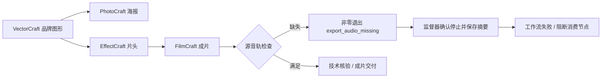

# ArtCraft 必需源音轨失败传递

## 契约与边界

事实源为 OpenSpec `AC-TX-002-AUDIO`。FilmCraft 要求音频时，导出器自动生成的静音 AAC 不能代替时间线中的真实源音轨。ArtCraft 消费 FilmCraft 的检查，不凭导出流存在宣布成片成功。剪映继续由自己的独立插件负责。

## 执行架构

## 技术方案

`native_diagnostics.ts` 的闭合错误码集合包含 `export_audio_missing`。解析仅接受完整、有界、单字段 JSON；未知后缀、冲突或非结构化文本只保存字节数与 SHA256。失败记录可由工作流和 status 查询，不保存原始用户输出。监督器停止证据仍是释放写占用的条件。

失败目录保留 `.fcproj`、预览、成片、`audio-check.json`、`export-probe.json` 与 `failure.json`；没有成功 manifest，不发布输出资产。依赖失败成片的消费者不启动；同一冻结计划复用原失败任务和尝试，不重新分配预算。真实静音源和明确 `audioRequired=false` 仍由 FilmCraft 的契约决定，不把零波形直接判为失败。

## 验证与发布状态

先复现错误码被吞掉的失败测试，再增加最小错误码支持。调度器／摘要目标测试 25 项通过；完整 Node 回归 139 项通过、6 项跳过。真实候选测试入口为独立技能源 `tests/test_required_audio_mixed_first_use.py`，用无音轨视频和四领域任务图核对原生失败、消费者阻断、失败目录、status、重复尝试／预算与源保全。

候选可通过 `--bundle-dir` 读取本地摘要绑定运行时，其他固定领域包保持其原发行字节。这不是公开新版本下载证明；OpenSpec 6.32 要求公开制品和固定宿主复验，现已由下述证据完成。不得据此关闭全部首次使用、GUI 或创作验收。

真实候选负向 1 项通过（40.599 秒），正常四工程与增益返工 1 项通过（36.998 秒）；Python 回归 66 项通过、18 项跳过。[候选证据](evidence/required-audio-mixed-candidate.json)。

默认公开运行时 dev.48 首次使用已通过：负向 58.653 秒、正向 56.587 秒；五个锁定包重建一致。固定插件宿主复验后续已通过，记录如下。[公开运行时证据](evidence/required-audio-public-runtime.json)。

固定插件 dev.49／技能源 dev.36／运行时 dev.48 已通过安装后公开首次使用：缺源音轨失败与后续阻断（66.696 秒）、正常四工程增益返工（82.108 秒）、十项 Art 技能逐项独立冷启动（119.288 秒）。全部 58 项安装摘要保留。6.32 在此限定范围完成，完整首版仍开放。 [Evidence / 证据](evidence/codex-release49-required-audio-mixed-first-use-20261006.json).
