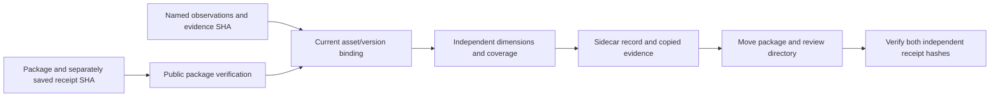

# ArtCraft review records architecture

## Authority and component boundary

Independent skill source dev.17 adds a Python standard-library review helper. Each of ten skills carries the helper and its pinned package/bootstrap dependencies. The orchestration runtime remains dev.16; no new native CLI command is claimed. Existing OpenSpec AC-QA-001 and its RECORD scenario are the authority. Model dispatch, GUI, full creative acceptance and the AC-QA-002 automatic revision loop remain open.

## Flow and trust anchors

`review.py record` invokes the skill's public `package.py verify`. It binds package SHA, plan SHA, owner and authorization to the verified package and resolves every observation against a child node's current asset ID/version/SHA. Responsible plugin and runtime identity are derived from the package, not accepted from the observation author. Brand references bind current child assets in the same way. Creative failures require an object ID, frame or normalized region.

Record output lives outside the immutable package. The helper copies source JSON and ordinary evidence files into a staged sidecar, names proofs by digest, rechecks the package before publication and refuses an existing output directory. Moving both directories preserves relative evidence and asset bindings. Verification trusts separately retained package and review receipt hashes, checks exact sidecar inventory, copied file hashes, source-to-portable mapping and recomputed dimensions.

## State and evaluator boundaries

Engineering PASS means package integrity verified through the existing public verifier. Technical, creative and acceptance values are **recorded evaluator observations**; file hashing does not independently establish whether those observations are correct. The helper does not authenticate the claimed evaluator, invoke a model, inspect pixels or listen to audio. Only an actual human's supplied observation may be represented as human acceptance; skills explicitly forbid fabricated acceptance.

Each output requires coverage in all three supplied dimensions. Missing coverage or NOT_RUN yields pending; any FAIL yields changes_requested; all PASS yields an accepted **record**. Creative PASS cannot override technical FAIL. Ledger task state remains review_ready in every outcome. No completed task transition, automatic rendering, revision or billing occurs here.

## Failure and deployment contract

Old package/plan/asset identities, mismatched owner/authorization, missing PASS/FAIL evidence, non-human acceptance, duplicate checks, unsafe locations, symbolic links, negative frame numbers, invalid normalized regions and changed proof digests are rejected. Per-file size is 8 MiB; total copied source/proofs are limited to 64 MiB. Failures preserve input package and task ledger; output publication is exclusive.

First use installs only fixed Node and orchestration dependencies for verification. Domains are selected only if workflow.py is separately used to create a package. This implementation supports the declared macOS arm64 platform; other platforms remain unverified.

## Validation and limits

Six unit tests cover status aggregation, stale references, evidence binding, human acceptance rules, locators, symlink rejection, exclusive publication, relocation and tampering. One live isolated review-skill test uses default public downloads, creates a native VectorCraft package, records a fixture technical observation, keeps creative/acceptance NOT_RUN, moves package and record, verifies with a fresh runtime-only cache, checks unchanged package/ledger bytes and rejects stale/tampered evidence. These are contract tests; fixture statements are not real creative acceptance. Full revision-cycle and user aesthetic acceptance remain separate gates.
