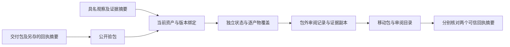

# ArtCraft 审阅记录架构

## 事实源与组件边界

独立技能源 dev.17 增加 Python 标准库审阅辅助入口，十个技能各自包含该入口及锁定安装、验包资源。编排运行时保持 dev.16，不虚构新的原生 CLI 命令。现有 OpenSpec AC-QA-001 的 RECORD 场景管理本行为；模型调度、GUI、完整创作验收和 AC-QA-002 自动修订循环仍未完成。

## 流程与信任锚

`review.py record` 调用本技能的公开 `package.py verify`，把包摘要、计划摘要、所有者与授权绑定到已验证包；每个观察绑定子节点当前资产 ID、版本及摘要。责任插件与运行身份从包中推导，不能由观察作者覆盖。品牌参考采用同样的包内资产绑定。创作 FAIL 必须定位到对象、帧或归一化区域。

审阅输出位于不可变交付包外。入口将原始 JSON 和普通观察文件复制到临时目录，证据按摘要命名，发布前再次验包，拒绝覆盖已有目录。两个目录移动后相对引用仍成立。重新核验使用此前另存的包与审阅回执摘要，检查精确文件清单、证据哈希、原始与可移动输入映射，并重新计算状态。

## 状态与评价者边界

工程 PASS 仅表示公开验包通过。技术、创作、接受均是**评价者观察的记录**；哈希不能独立证明观察内容正确。记录器不认证声明的评价者身份、不调用模型、不看图或听音频。人工接受只能来自真实用户提供的观察；技能明确禁止伪造人工接受。

所有当前输出都必须覆盖三个评价维度。缺项或 NOT_RUN 得到 pending；任一 FAIL 得到 changes_requested；全部 PASS 得到 accepted **记录**。创作 PASS 不能覆盖技术 FAIL。所有结果的账本任务仍为 review_ready，不执行 completed 状态提升、自动渲染、修订或付费调用。

## 失败与部署合同

旧包／计划／资产身份、所有者或授权不符、无证据 PASS/FAIL、非人工接受、重复检查、逃逸路径、符号链接、负帧号、非法区域、被修改的证据摘要均拒绝。单文件上限 8 MiB，源输入与证据复制合计上限 64 MiB。失败保留包与账本，输出独占发布。

首次验包只安装固定 Node 与编排依赖；仅另行通过 workflow.py 创作时按图安装领域工具。当前声明 macOS arm64 支持，其他平台未验证。

## 验证与限制

6 个单元测试覆盖状态聚合、旧引用、证据绑定、人工接受限制、定位、链接拒绝、独占输出、移动与篡改。1 个真实隔离审阅技能测试使用默认公开下载，生成 VectorCraft 原生包，记录测试技术观察，保持创作／接受 NOT_RUN，移动包与记录，使用全新仅编排缓存重新核验，检查原包／账本字节不变并拒绝旧引用和篡改。这些是记录合同测试；测试声明不是实际创作验收。完整修订循环与用户审美接受仍有独立门禁。
