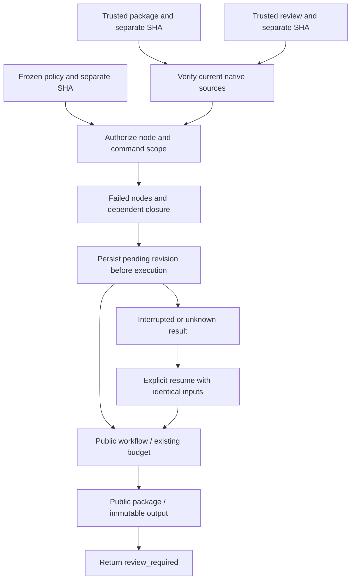
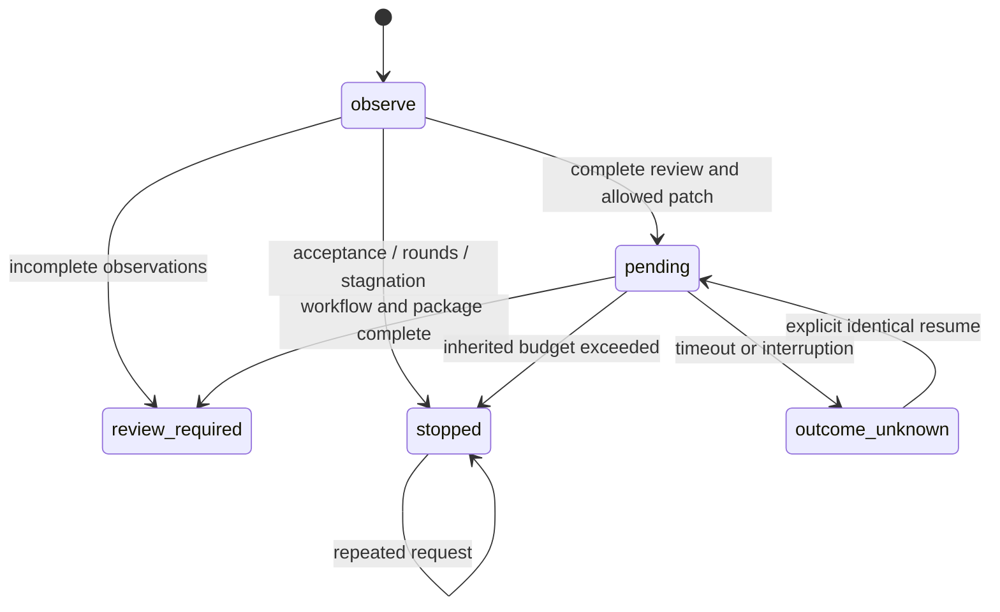

# ArtCraft revision cycle architecture

## 1. Authority and scope

OpenSpec AC-QA-002-STEP governs this independent Python helper. `revision.py step/status` lives in each independently installable skill and calls public workflow, package and review helpers. The native runtime remains dev.16. No additional native CLI command or model evaluator is claimed.

## 2. Component flow

The installed `SKILL.md` directory owns script resolution. A single copied revise skill contains all required local helpers. Bootstrap selects only domains needed by the plan. Installation caches and editable projects have separate locations.

## 3. Contracts and native preservation

The policy freezes workflow, owner, authorization reference, caller-declared target digest, allowed node/command pairs, maximum rounds and stagnation limit. Its separately trusted file SHA binds policy identity. A request names a new revision and explicit operations for every affected native node. It cannot supply new DAG nodes, tool identities, budgets or deadlines. Unrelated nodes reuse existing tasks.

The helper verifies the original package before deriving a plan. A changed child opens the currently packaged native source, bound by its SHA; dependent asset bindings resolve updated upstream output IDs. Old projects, collected inputs and package files remain unchanged. New files are written into revision plan/package directories. Explicit patches are supplied by the caller, not generated by an evaluation model.

## 4. State, retries and termination

A project lock serializes calls. The fsynced journal persists round allocation and the exact pending plan before editing. A request key binds policy, source package, review and patch. Known repeats verify the generated package and reuse the receipt. Unknown results cannot start a new edit; explicit resume revalidates saved inputs and plan before invoking durable workflow recovery. Resuming package creation does not allocate another task or budget round.

Stagnation compares the count of declared FAIL observations, not aesthetic quality. Every current output needs technical and creative observations before another edit. Best anchors retain the lowest observed failure count among technically passing candidates; stopping re-verifies the saved package and reports PASS, FAIL or NOT_RUN honestly. A stopped cycle cannot restart by changing its journal. A new goal or expanded scope requires separate authorization and project policy.

## 5. Verification and limits

Eight targeted unit tests cover policy scope, native source derivation, stop rules, unknown results, plan tampering, journal counters and saved package verification. One real isolated cold-first-use test covers three stop-policy subcases, Logo recolor, dependent poster edits, unrelated task reuse, immutable originals and a killed controller followed by explicit recovery. Evidence is in `docs/evidence/revision-cycle-first-use.json`.

Fixture feedback tests the revision contract; it does not prove creative acceptance. Evaluator authentication, automatic model patch generation, semantic target-drift detection, parameter-level authorization, GUI operation and complete mixed creative delivery remain unverified. The ledger remains `review_ready`. These limits keep broader AC-QA-002 implementation and acceptance tasks open.

## 6. Unresolved issue delivery

Stop receipts carry the latest verified observation snapshot in `unresolvedIssues`, retaining check identity, dimension, target, responsible plugin, runtime identity, note and evidence. `issueSource` binds the snapshot package/run and review receipt SHA. This source can differ from `bestPackage`; best-package integrity does not clear current failed observations. `recorded_observation` means persisted observations, not a new evaluation. Legacy journals without a snapshot report NOT_RUN. A newly accepted record clears older failures while leaving the task ledger unchanged.
