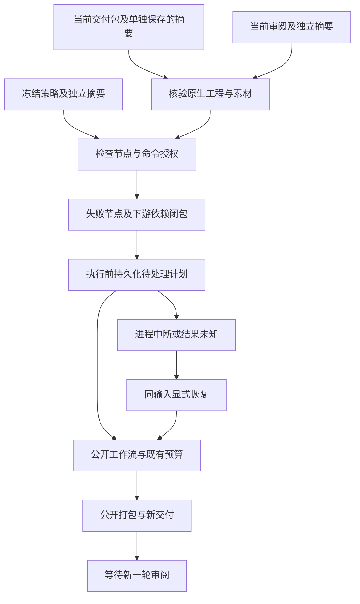
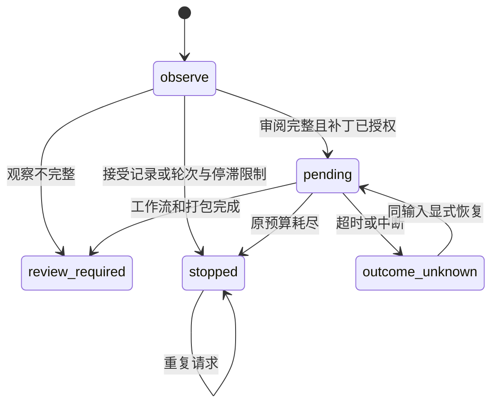

# ArtCraft 局部返工协调架构

## 1. 规范与组件边界

规范事实源为 OpenSpec AC-QA-002-STEP。各独立技能携带 Python 标准库实现的 `revision.py step/status`，通过公开 workflow、package、review 脚本完成返工。原生编排运行时继续使用 dev.16；此入口属于技能辅助脚本。

## 2. 调用与交付流

以宿主实际加载的 `SKILL.md` 所在目录定位脚本。单独安装返工技能即包含所需脚本，按计划安装需要的领域 CLI。技能目录、运行时缓存与可编辑项目分开管理。

## 3. 冻结策略与原生编辑

策略冻结工作流、所有者、授权引用、调用者声明的目标摘要、允许的节点与命令、最大轮数和停滞阈值，另行保存的策略文件摘要作为信任锚。补丁请求必须使用新修订名，并显式覆盖每个受影响的原生节点；不能注入新节点、工具身份、预算或截止时间。无关节点复用已有任务。

协调器先核验原交付包，再以当前打包的原生工程及其摘要创建编辑计划。下游素材引用解析新上游输出。原工程、素材和旧包保持原有字节，新计划与新包使用独立目录。编辑操作由调用者明确提供。

## 4. 状态、恢复与停止

项目锁保证串行调用。日志在编辑前持久化轮次及精确计划；请求键绑定策略、源包、审阅和补丁。重复已知请求核验新包后返回缓存回执；未知结果阻止新编辑，显式恢复重新核验输入与保存计划，再调用持久化工作流。恢复打包不会重复分配任务或预算轮次。

停滞按声明的 FAIL 观察数量判断，不是审美评分。所有当前输出必须有技术与创作观察才能继续。最佳锚保留技术通过候选中失败数量最低的包；停止时重新核验，并如实返回 PASS、FAIL 或 NOT_RUN。停止后的周期不能通过修改日志重启；新目标或扩权需要独立授权与项目策略。

## 5. 验证与未完成边界

八项单元测试覆盖策略、源工程绑定、停止规则、未知结果、计划篡改、日志计数和最佳包核验。一项真实单技能冷启动测试包含三个停止策略子场景，验证 Logo 改色、关联海报更新、无关任务复用、旧交付不变，并终止协调进程后显式恢复。证据见 `docs/evidence/revision-cycle-first-use.json`。

测试使用声明的反馈 fixture，只证明返工合同。评价者身份认证、自动模型补丁、语义目标漂移识别、参数级授权、GUI 和完整混合创作验收尚未证明；任务账本仍为 `review_ready`。因此 AC-QA-002 的整体实现及验收任务继续保持未完成。
