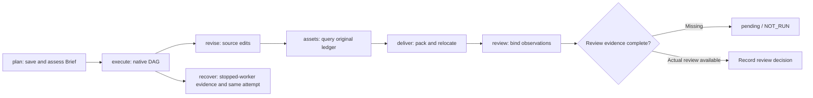

# ArtCraft Role First-Use Acceptance Architecture

> **Purpose**: Define the fixed installed skills, isolated caches and observable role actions covered by this acceptance.
>
> **Version**: V1.0.0
> **Updated**: 2026-10-07

## 1. Identity and scope

The system under test is the public plugin dev.98 installed copy, Art skills dev.72 and runtime dev.83. Dependencies pin Film/Vector dev.28 and Effect/Photo dev.29. Test drivers live in the independent skills repository. Each handoff removes the previous copied skill and uses a previously absent runtime directory. Project and package data continue across handoffs; runtime caches do not.

## 2. Role flow

| Role | Observable acceptance | Limit |
| :--- | :--- | :--- |
| plan | Save/move Brief, reject native-format conflicts, retain native inspection gates | Declared constraints only |
| execute | Cold single-skill installation, four-domain DAG, source revisions and portable package | One representative mixed scenario |
| revise | Four source revisions, unrelated-node reuse, original files/captions/audio preserved | Authorized target objects |
| assets | Query existing tasks and leases | Does not cover all asset registration routes |
| deliver | Collect five child projects and verify relocated package | Hash and reference integrity |
| review | Record/move/verify observations; reject stale assets and tampering | Creative and human acceptance remain NOT_RUN |
| recover | Idempotent cancellation; owned scheduler SIGKILL, same-attempt recovery, one native spawn | Worker crashes and unknown submission windows remain separate |

## 3. Evidence and failures

`docs/evidence/artcraft98-role-first-use-20261007.json` records the immutable host lock, skill hashes, native output/package observations and actual test results. Failed tests do not create success records. Unsupported or unexecuted dimensions stay open. Runtime digest errors are rejected; unknown results are not replayed. Recovery requires persisted independent-worker stopping evidence.

This changes test isolation and evidence capture, retaining installer, native CLI and runtime versions. Generic Skills CLI installation, exhaustive command contexts, other platforms and complete V1 are separate gates.

---

**Document version**: V1.0.0
**Created**: 2026-10-07
**Updated**: 2026-10-07
**Status**: Pending review; evidence records determine execution status
