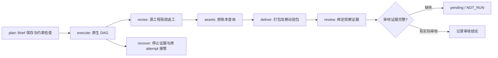

# ArtCraft 角色技能首次使用验收架构

> **文档说明**：限定固定安装技能、独立缓存和真实角色操作的验收证据。
>
> **版本**：V1.0.0
> **最后更新**：2026-10-07

## 1. 固定身份与范围

被测对象为公开插件 dev.98 安装副本中的 Art 技能源 dev.72，运行时 dev.83；领域依赖固定为 Film／Vector dev.28、Effect／Photo dev.29。测试代码属于独立技能仓，不能把工作树技能作为固定安装产品。每个角色只复制自己的技能目录；交接时删除上一技能副本，并给新角色分配不存在的运行时目录。用户工程和交付包继续传递，缓存不传递。

## 2. 调用与交付

| 角色 | 本轮可观察验收 | 验收边界 |
| :--- | :--- | :--- |
| plan | 保存并移动 Brief；拒绝格式冲突，保留原生检查要求 | 计划声明不代替原生产物检查 |
| execute | 单技能冷安装后执行四领域 DAG、源修订和移动包 | 一个代表混合场景 |
| revise | 修改四个源工程，复用无关节点，保全旧文件、字幕与音频 | 明确授权的修改对象 |
| assets | 查询既有账本的任务和占用 | 不宣称覆盖全部素材登记路径 |
| deliver | 收集五个子工程，移动后核验包 | 摘要与工程引用完整性 |
| review | 保存、移动、核验观察记录；拒绝过期与篡改证据 | 创作评价及人工接受为 NOT_RUN |
| recover | 幂等取消；实际调度器 SIGKILL 后同 attempt 恢复、一次原生启动 | worker 崩溃和未知提交窗口另行验收 |

## 3. 证据与失败处理

验收以 `docs/evidence/artcraft98-role-first-use-20261007.json` 为事实记录。记录固定宿主锁、技能摘要、独立原生输出和包摘要以及测试结果。失败的测试不生成成功证据；不支持或未执行的维度保留未完成。运行时制品摘要错误必须拒绝，unknown 不重放；恢复先核对独立 worker 的停止证据。

本轮不改变安装器、原生 CLI 或运行时版本。测试驱动新增角色独立缓存断言及证据记录，不能据此关闭通用 Skills CLI 安装、全部命令上下文、其他平台或完整 V1。

## 4. 登记媒体补充验收

素材角色追加三个固定安装原生用例：PNG到JPEG替换、SVG替换、PCM音频登记。图像更新依赖产物并保全无关对象和旧交付，拒绝SVG外部依赖；PCM元数据和原生音轨经五子工程移动包核验保留。音频使用常量测试信号，未验证语音内容和听感。[证据](evidence/artcraft98-assets-role-first-use-20261007.json)。完整协议和其他媒体变体保持开放。

---

**文档版本**：V1.0.0
**创建日期**：2026-10-07
**最后更新**：2026-10-07
**文档状态**：待评审；执行结果以证据记录为准
