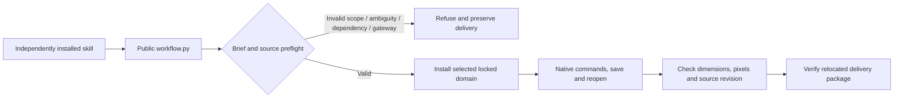

# ArtCraft fixed-release routing scenario revalidation

This run binds plugin `0.1.0-dev.126`, skill source `0.1.0-dev.98`, and runtime `0.1.0-dev.126-runtime.1`. Production bytes are unchanged; test and documentation maintenance does not replace immutable releases. See [routing evidence](evidence/routing-scenes-fixed126-20261008.json).

| Path | Evidence | Limit |
|---|---|---|
| Real mixed ASR | First Whisper download, real narration inference, five children, brand revision, unrelated badge reuse, unchanged caption timing and moved package | Procedural branding and system speech sample; no creative acceptance |
| Vector appearance | Gradient/multiple fills, trusted source swatch revision, target change, unchanged control pixels, IDs, geometry and top fill | PDF header only; visual PDF acceptance not run |
| Effect expression | Actual alpha at two times, preserved parent/control/composition, source revision and moved package | Not exhaustive effects or expressions |
| Photo adjustment | Reopened native parameters and mask, target/control pixels, other layers and moved package | Not full PSD compatibility |
| Untrusted Photo source | Public refusal for missing artifact/root and wrong/missing native digest; original delivery unchanged | Missing root refused by runtime preflight; no native or image delivery |
| Four-domain gateway | Five-child workflow, source revision, reuse, corruption/recovery, unknown preservation and cancelled-stage reopen without replay | Direct-adapter fixture logical version is recorded separately from pinned native and resource identities |
| Complete-command component | Real create/revise/save/reopen, non-target objects and rendered results in each domain; component never claims DAG completion | 2646 catalog entries do not prove exhaustive command execution |
| Ten independent entries | Separate empty caches, Brief gateway, four pre-download refusals, actual widths 128→160→192, source preservation and moved package | This batch uses one Vector scene per entry; it does not rerun the full mixed workflow through every entry |

The cancellation test previously counted `.effectcraft-execution-*.json` identity files as stages because of their shared prefix, producing 2≠1. It now counts directories only. Assertions still require exactly one stage, cancellation after actual native rendering, a stopped process group, zero leases, native reopen and one execution spawn. Both failed and corrected logs are retained. Production cancellation logic was not changed.

Default source regression: 189 tests, 140 passed and 49 skipped. Plugin Python: 112 tests, 106 passed and 6 skipped. Runtime: 299 tests, 278 passed and 21 skipped. Optional native runs are executed separately with explicit switches; skips are not passes.

Task 6.6 remains open pending the full matrix and old-evidence identity audit, especially full mixed-gateway cold starts, local revisions and delivery through all ten entries. Full V1, exhaustive commands, GUI, other platforms and generic Skills CLI installation remain separate gates. The 26 numbered open tasks retain their status; incomplete specifications must not be synced or archived.
