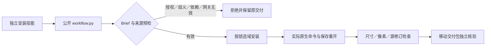

# ArtCraft 固定版本路由场景补验

本文保留此前检查点。任务6.6现已完成，见[当前11场景完整验收](ArtCraft-Capability-Routing-Acceptance-Architecture.zh_CN.md)。

本次补验固定 Art 插件 `0.1.0-dev.126`、技能源 `0.1.0-dev.98`、运行时 `0.1.0-dev.126-runtime.1`。生产资源未变化；测试与文档维护不创建替代发布。证据见 [路由场景记录](evidence/routing-scenes-fixed126-20261008.json)。

| 验收路径 | 当前证据 | 边界 |
|---|---|---|
| 真实 ASR 混合任务 | 首次 Whisper 下载、真实配音识别、五子工程、品牌返工、无关徽标复用、字幕时序保持、移动包 | 合成品牌图形和系统配音样本；不证明创意质量 |
| Vector 外观 | 渐变／多填充、可信源色板返工、目标变化、控制区与 ID／几何／顶层填充保持 | PDF 仅检查文件头，视觉验收未执行 |
| Effect 表达式 | 两个时间点真实 Alpha、父级／控制图层／合成保持、源返工、移动包 | 不是全部效果和表达式枚举 |
| Photo 调整 | 原生重开后参数和蒙版、目标／控制像素、非目标层保持、移动包 | 非 PSD 全兼容性验收 |
| Photo 非可信源 | 缺 artifact、缺根目录、错误／缺失原生摘要四种公开拒绝；原交付不变 | 缺根目录由运行时预检拒绝；未生成原生或图片交付 |
| 四域网关 | 五子工程联动、源返工、复用、损坏／恢复、unknown 保全；取消后重开且不重放 | 内部适配器 fixture 的逻辑插件版本单列；原生 CLI 和领域资源按固定安装核验 |
| 完整命令组件 | 四域分别实际创建、修改、保存重开、检查非目标对象和渲染；调用不冒充 DAG 完成 | 2646 目录查询不等于 2646 命令全部执行 |
| 十个独立入口 | 各自空缓存、带 Brief 网关、下载前四类拒绝、尺寸 128→160→192、原工程保全及移动包 | 本批十入口为单 Vector 场景；不是十入口分别执行完整四域混合任务 |

取消测试原先按名称前缀统计暂存目录，把 `.effectcraft-execution-*.json` 身份文件计入，出现 2≠1。测试改为只统计目录，仍要求唯一暂存工程、真实 render 后取消、进程组停止、零租约、原工程重开和唯一启动；失败及修正后日志分别保留。没有修改生产取消逻辑。

常规技能源回归 189 项：140 通过、49 跳过；插件 Python 回归 112 项：106 通过、6 跳过；运行时回归 299 项：278 通过、21 跳过。可选原生任务使用明确环境开关单独执行，不能把跳过计为通过。

6.6 继续开放，剩余完整矩阵与旧证据的版本绑定仍须审计，特别是十入口各自完整混合网关冷启动、局部返工及交付。完整 V1、逐命令执行、GUI、其他平台和通用 Skills CLI 安装不由本证据关闭。其余 26 项编号任务保持原状态；不得同步或归档未完成规格。
