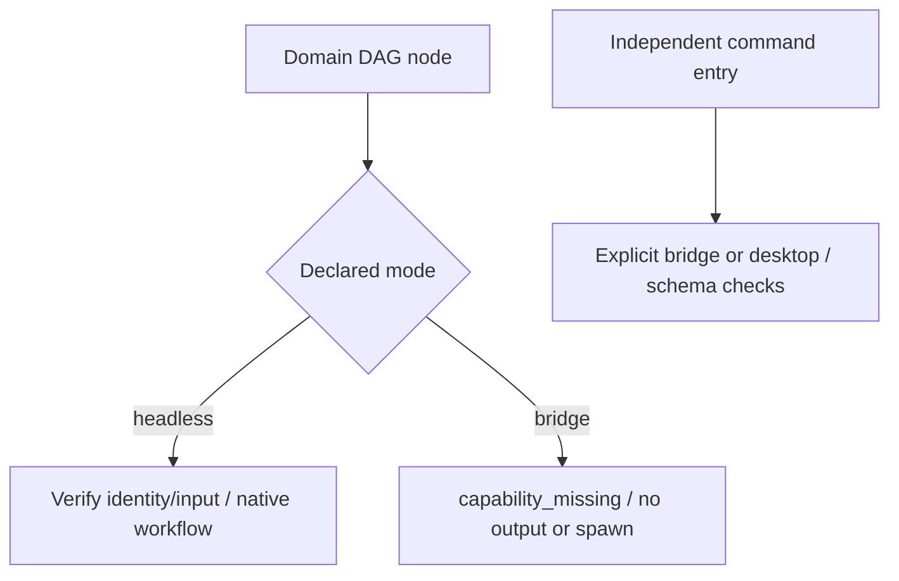

# ArtCraft Explicit Runtime Mode Boundary Architecture

Actual installed Art131/runtime130 prepares headless workflow.py launches for bridge identities in all four DAG domain adapters. The regression probe only calls prepare and does not spawn native editing. Original four-domain failures and argv are retained. Public task identities distinguish headless and bridge, and adapters must honor that distinction.

Candidate runtime131 refuses unsupported bridge DAG workflows with capability_missing immediately after domain identity checking, before material reads or output-directory creation. Existing headless execution and identity checks remain intact. The independent full-command component retains its explicit bridge/desktop schema, connection and control-token paths; this DAG refusal does not globally disable bridge commands.

Four new tests first fail, then verify bridge refusal and headless preparation. Target tests pass10/11 with1 conditional skip. The candidate parent and fixed native domain create and reuse an actual Effect project. Independent installed command checks reject ui_inspect in headless and accept bridge/desktop structure with nativeExecution=NOT_RUN. Runtime regression passes305/330 with25 conditional skips. [Candidate evidence](evidence/mode-boundary-candidate-20261009.json) retains logs and hashes.

Task4.17 remained open at candidate stage; fixed distribution acceptance below is now complete. Overall4.6 remains open. The new MODE scenario preserves all prior requirements: the full count is now15, while the historical131 audit covers its original14-scenario snapshot. GUI, actual bridge interaction, Skills CLI, other platforms and completeV1 remain unqualified.

Fixed132/source104/runtime131 installs in isolated Codex0.147.0 with5 plugins/64 skills and zero loading errors. Ten skills independently cold-download public Node/core using system PATH and separate empty runtimes;20 version/help calls and10 actual missing-ledger upgrade refusals pass. The installed parent refuses all four bridge DAG requests with capability_missing before output creation. Independent command headless refusal and bridge/desktop structural checks pass, without claiming native GUI interaction.

The empty-cache mixed suite passes3 tests: one complete native integration and two archive-argument checks. Its22 public calls cover four-domain creation/source revision/reuse, frozen identity protection, Photo variant tamper/restoration and a four-child moved package. Only after the mixed process restores its original receipt,36 native post-save reply faults pass using the installed core, with original-stage reopening, no replay, blocked consumers and preserved registered inputs. No worktree core override is used.

All64 trees, complete domain bundles and35 core files are rehashed after use. Thirty-three core files are identical; removing the two-line bridge refusal from public_skill.ts yields the exact prior source, while package.json changes version. Installer/precheck scripts and command indexes are unchanged. All three public release-asset digests match local ZIPs, and five locked bundles rebuild exactly. [Fixed evidence](evidence/fixed-mode-distribution132-20261009.json) separates current installation from justified unchanged-path evidence. The [132 audit](evidence/runtime-upgrade-scenario-audit132-20261009.json) supports13/15 scenarios:3 current installed and10 explicitly reused. Prior131 audit and failures remain retained.

Bounded gate4.17 completes. Twelve numbered tasks remain open, including4.6, actual Skills CLI, GUI, complete public protocol matrices and formal release gates. OpenSpec is not archived and no marketplace promotion occurs.
