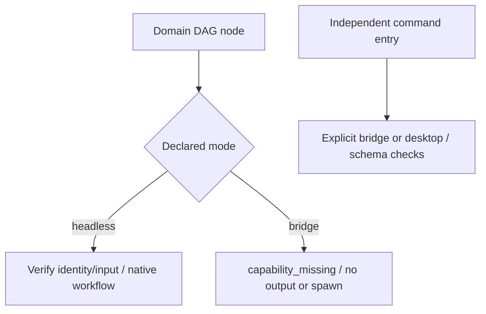

# ArtCraft Explicit Runtime Mode Boundary Architecture

Actual installed Art131/runtime130 prepares headless workflow.py launches for bridge identities in all four DAG domain adapters. The regression probe only calls prepare and does not spawn native editing. Original four-domain failures and argv are retained. Public task identities distinguish headless and bridge, and adapters must honor that distinction.

Candidate runtime131 refuses unsupported bridge DAG workflows with capability_missing immediately after domain identity checking, before material reads or output-directory creation. Existing headless execution and identity checks remain intact. The independent full-command component retains its explicit bridge/desktop schema, connection and control-token paths; this DAG refusal does not globally disable bridge commands.

Four new tests first fail, then verify bridge refusal and headless preparation. Target tests pass10/11 with1 conditional skip. The candidate parent and fixed native domain create and reuse an actual Effect project. Independent installed command checks reject ui_inspect in headless and accept bridge/desktop structure with nativeExecution=NOT_RUN. Runtime regression passes305/330 with25 conditional skips. [Candidate evidence](evidence/mode-boundary-candidate-20261009.json) retains logs and hashes.

Tasks4.17 and4.6 remain open pending immutable distribution, ten standalone cold first uses and installed mode/mixed acceptance. The new MODE scenario preserves all prior requirements: the full count is now15, while the historical131 audit covers its original14-scenario snapshot. GUI, actual bridge interaction, Skills CLI, other platforms and completeV1 remain unqualified.
