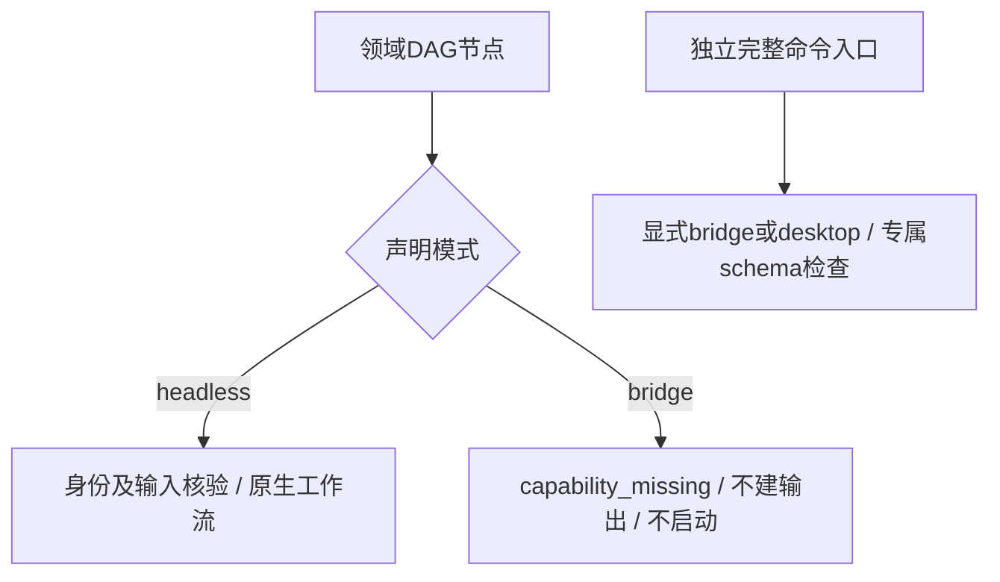

# ArtCraft 显式运行模式边界架构

固定Art131／runtime130的四领域DAG适配器接受bridge运行身份，却准备headless的workflow.py启动。本次实际安装探测只执行prepare，不启动原生编辑；四领域红灯及原始argv保留。公开协议允许headless／bridge身份，适配器必须忠实于请求模式。

候选runtime131在领域身份检查后、读取素材和建立输出目录前，拒绝该DAG适配器未提供的bridge工作流，错误为capability_missing。现有headless路径保持原启动和身份核验。完整命令组件的独立显式bridge／desktop入口仍按自己的schema、会话连接与控制权限执行，不能把DAG拒绝解释为全局禁用bridge。

四领域新增测试先全部红灯，再验证bridge拒绝及headless正常准备；目标11项中10通过、1条件跳过。实际固定子包配合候选父核心创建并复用Effect原生工程；独立固定命令组件headless拒绝ui_inspect、bridge／desktop结构检查通过但nativeExecution为NOT_RUN。完整运行时330项中305通过、25条件跳过。[候选证据](evidence/mode-boundary-candidate-20261009.json)记录原始日志与摘要。

候选阶段4.17保持开放；以下固定分发复验现已完成。4.6整体继续开放。新增MODE场景不削减既有要求；当前完整场景数变为15，旧131审计的14项属于其原规格快照。GUI、真实bridge交互、Skills CLI、其他平台和完整V1未由本次候选证明。

固定分发132／源104／runtime131已通过实际隔离Codex0.147.0安装，5插件／64技能、零加载错误。十技能分别使用系统PATH与各自空运行时公开冷下载，20次版本／帮助及10次缺失账本升级拒绝通过。实际安装父核心对四领域bridge DAG返回capability_missing，没有创建输出；独立完整命令组件的headless拒绝及bridge／desktop结构检查通过，仍不声称原生GUI交互。

空缓存真实混合交付集3项通过，其中1项是完整原生混合用例，另2项为归档参数检查；22次公开调用覆盖四领域创建／源修订／复用、冻结身份保护、Photo变体篡改与恢复、四子工程移动包。等待混合进程恢复原回执后，36项保存后原生响应故障全部通过，原暂存重开、不重放、下游阻断和登记素材保全。故障矩阵加载新固定安装核心，未使用工作树覆盖。

使用后64目录与四领域完整源包、35核心文件重新核验；33核心文件字节不变，public_skill.ts仅新增两行bridge拒绝，移除该片段即与旧文件完全一致，package.json更新版本。安装／预检脚本和命令索引不变。公开三个发行资产摘要与本地ZIP相同，五包重建一致。[固定证据](evidence/fixed-mode-distribution132-20261009.json)明确当前安装与既有未变路径证据的适用边界；[132审计](evidence/runtime-upgrade-scenario-audit132-20261009.json)为13/15：3项当前安装、10项明确依据复用。旧131审计及红灯保留。

有界修复门禁4.17已完成。4.6、实际Skills CLI、GUI、公共协议完整矩阵与正式发布等12个编号任务仍开放，不归档OpenSpec，不加入可安装市场。
