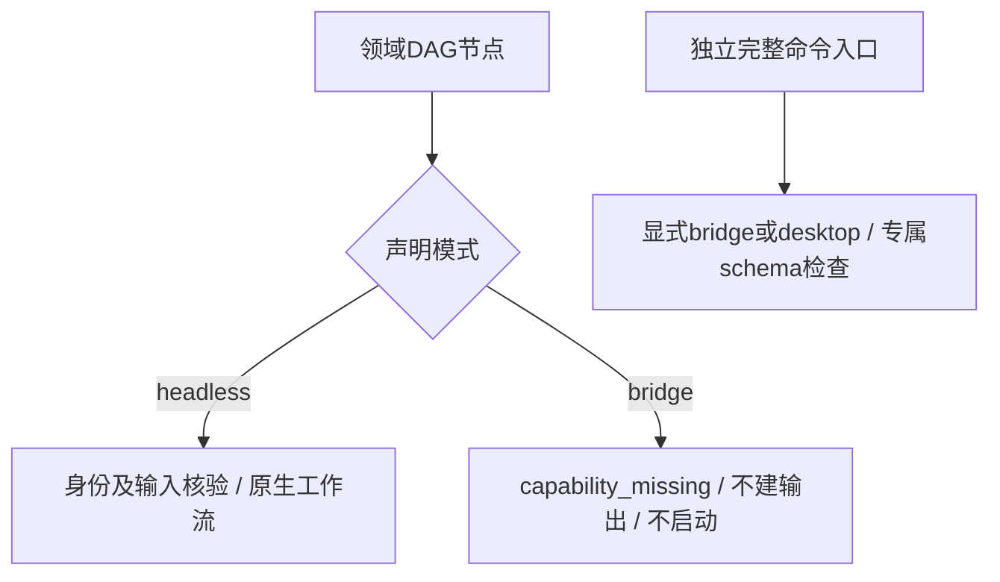

# ArtCraft 显式运行模式边界架构

固定Art131／runtime130的四领域DAG适配器接受bridge运行身份，却准备headless的workflow.py启动。本次实际安装探测只执行prepare，不启动原生编辑；四领域红灯及原始argv保留。公开协议允许headless／bridge身份，适配器必须忠实于请求模式。

候选runtime131在领域身份检查后、读取素材和建立输出目录前，拒绝该DAG适配器未提供的bridge工作流，错误为capability_missing。现有headless路径保持原启动和身份核验。完整命令组件的独立显式bridge／desktop入口仍按自己的schema、会话连接与控制权限执行，不能把DAG拒绝解释为全局禁用bridge。

四领域新增测试先全部红灯，再验证bridge拒绝及headless正常准备；目标11项中10通过、1条件跳过。实际固定子包配合候选父核心创建并复用Effect原生工程；独立固定命令组件headless拒绝ui_inspect、bridge／desktop结构检查通过但nativeExecution为NOT_RUN。完整运行时330项中305通过、25条件跳过。[候选证据](evidence/mode-boundary-candidate-20261009.json)记录原始日志与摘要。

任务4.17与4.6保持开放，尚需新不可变分发、十技能独立冷首用及安装后模式拒绝／混合工作流复验。新增MODE场景不削减既有要求；当前完整场景数变为15，旧131审计的14项属于其原规格快照。GUI、真实bridge交互、Skills CLI、其他平台和完整V1未由本次候选证明。
