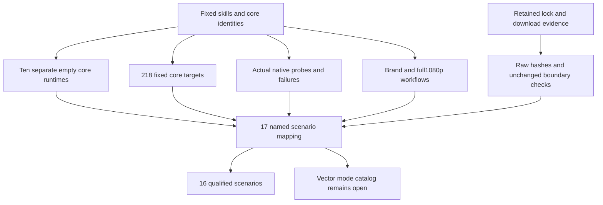

# ArtCraft current runtime scenario acceptance

Fixed plugin140/source112/runtime139-runtime.1 on macOS arm64 qualifies16 of17 named AC-RT-002 scenarios using current execution or explicitly applicable retained evidence. Vector still has763 mode records/762 unique IDs and conflicting file.place descriptors. Strict refusal remains; tasks4.6 and4.19 stay open, along with ten numbered tasks and full V1.

## Execution and evidence boundaries

| Check | Result | Evidence scope |
| :--- | :--- | :--- |
| Independent cold entries | Ten skills,30 public calls pass | Separate empty Node/core caches; version, help and missing-ledger upgrade refusal. Every call verifies39 core files. Exact ZIP skill copies, not generic Skills CLI or host discovery. |
| Fixed core | 218 pass, no skips | All-mode command/schema identity, post-refusal edit prohibition, explicit DAG mode checks and readonly legacy ledger defenses. |
| Actual native readonly probes | 40 command and20 tool cases pass | Controlled drift after genuine native responses; these probes do not perform edits. |
| Post-save native faults | 36 pass across four domains | Nine fault types, original project reopen, downstream blocking, confirmed stop and no replay. |
| Strict plans | 240 subcases pass across ten skills | Duplicate root/operation/parameter keys refuse before installation or output creation. |
| Legacy readonly | 15 mutation refusals and4 public calls pass | Module/SQLite readonly defenses, public status/cancel and unknown schemas0/77; combined with the prior29-call actual upgrade/rollback checkpoint. |
| Brand workflows | Two entries retain nine variants and five moved projects | Changed associated pixels, unchanged unrelated SVG/PNG/PDF/tasks, repeated revision reuse; two native mutation faults, two helper trust refusals, two tamper refusals and two empty-export cases. |
| Full segmented HD | 1920x1080,24fps,5seconds,120frames pass | Four segments; every source-frame hash/RGBA/alpha, full independent decode,8 pixel assertions, Logo propagation, independent reuse, corruption recovery and five moved native projects. Verified native cache; cold entry proof remains separate. |
| Skills source regression | 219 total:166 pass,53 conditional skips | Includes four stream-decoder tests; skips do not count as native success. |

All ten skill trees and39 immutable core files are reverified after execution. Three actual desktop/bridge workflows retain their136 identities. Current delegation files match exactly; after excluding only the new Film-budget branch, MCP guard bytes match runtime135. That branch is unused by these desktop/bridge paths. Current218 targets cover the active guard separately; retained GUI sessions are not represented as newly launched.

## Retained evidence applicability

Four child installers and actual native binaries match130 download/mutex evidence digests. Art bootstrap/download/Node lock are unchanged. Eight setup validation/installation functions retain identical ASTs; a new helper binds the native command snapshot, exercised by current native workflows. Twelve retained raw artifacts are rehashed. Lock/download scenarios reuse only these unchanged boundaries, preserving original versions and dates.

Two new spec-ownership assertions first fail because six runtime scenarios sit under the desktop requirement heading. Moving the intact desktop block restores17 runtime and4 desktop scenarios to their own requirements without changing any clause or ID. Both assertions pass. Historical spec digests remain historical; this audit binds the current corrected structure.

## Decode integrity and remaining gates

Independent ffmpeg reads all746,496,000 RGB bytes and computes their digest, retaining only frames0/60/119 for the original8 pixel assertions. Resolution, duration and frame count are unchanged; all frames are decoded. Tests reject truncation, extra bytes and decoder failure. Initial collection failed because the helper module did not exist; it is not reported as four behavioral red tests.

The [machine audit](evidence/runtime-scenario-audit140-20261009.json) maps17 scenarios to evidence groups, immutable core files, test/log digests and remaining gates. Vector descriptors are not selected or namespaced to bypass duplication. Actual generic Skills CLI installation still awaits authorization/tool availability;3.6/3.16 remain open. Formal host/release and permission/secret gates retain their P0 prerequisites. Runtime/assets/tags are unchanged; OpenSpec is not archived and full V1 is not complete.

Local plugin regression and vendor/doc checking initially exhausted temporary space; the failed attempt is excluded. Four ended, identity-verified QA130 Node copies were checked for open handles and removed. Native CLIs, projects, media, proofs/logs, archived runtimes and the active verified cache are preserved; passing retry evidence is recorded separately.
