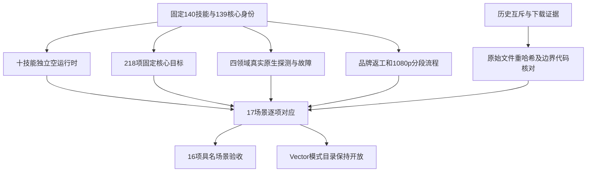

# ArtCraft 当前运行时逐场景验收

插件140／独立技能源112／runtime139-runtime.1 在 macOS arm64 的 AC-RT-002 共17个具名场景中，16项具有当前执行或明确适用的保留证据。Vector 模式目录仍存在763条记录／762个唯一ID及两个参数冲突的 `file.place`，严格拒绝保持有效，任务4.6与4.19均不勾选。完整V1仍有10项编号任务未完成。

## 执行与证据边界

| 验证 | 实际结果 | 可证明的范围 |
| :--- | :--- | :--- |
| 独立冷入口 | 十技能、30公开调用通过 | 每项独立空Node／核心缓存，版本、帮助和不存在账本升级拒绝；30调用均复核39项核心文件。原始来源为固定ZIP解包，未声称通用Skills CLI或宿主发现。 |
| 固定核心 | 218项通过，无跳过 | 所有模式的目录／参数身份、工具schema、拒绝后禁编辑、显式DAG模式边界和旧账本只读防线。 |
| 真实原生只读探测 | 40命令目录＋20工具schema案例通过 | 实际原生响应后注入受控漂移，验证编辑前拒绝；这些案例本身不执行编辑。 |
| 保存后故障 | 四领域36项通过 | 九类响应故障、实际原生工程重开、下游阻断、停止确认、任务／预算保全与不重放。 |
| 严格计划 | 十技能240子用例通过 | 重复根键、操作键与参数键在安装及输出前拒绝。 |
| 旧账本只读 | 15类写入拒绝与4公开调用通过 | 模块与SQLite只读双防线、公开status／cancel及未知schema0／77；与前轮29次实际升级调用联合覆盖迁移和回退。 |
| 品牌流程 | 两入口各九变体及五工程移动包通过 | 关联像素更新、无关SVG／PNG／PDF与任务保全、重复修订复用；另有两项原生越界修改故障、两项受信辅助脚本拒绝、两项旧计划篡改及两项空导出。 |
| 完整分段HD | 1920×1080、24fps、5秒、120帧通过 | 四分段、全部源帧摘要／RGBA／alpha、完整独立解码、8像素断言、Logo传播、无关复用、损坏恢复与五子工程移动包；使用已核验原生缓存，冷入口另证。 |
| 独立技能源回归 | 219项：166通过、53条件跳过 | 包含4项流式解码辅助测试；条件跳过不计为原生通过。 |

所有技能树与39项不可变核心文件执行后均复核。三个桌面／bridge实际流程保留固定136的原始身份，当前公开委派文件与其完全一致；除新增Film专用预算分支之外，严格MCP守卫字节一致，该分支不用于这些桌面／bridge路径。当前218项测试另覆盖正在执行的守卫，不把保留GUI流程写成新启动。

## 保留证据如何适用

四个领域安装器及实际原生二进制与固定130下载／互斥证据的摘要一致。Art bootstrap、download与Node锁未变，setup的8个验证／安装函数AST未变；其新增辅助函数将命令快照加入启动身份，当前原生流程已实际使用。12份历史原始证据重新计算摘要，互斥／下载场景只在这组未变边界内沿用。版本号、冷安装来源和执行时间保留历史身份，没有把旧安装包改记成140。

本次规格结构校验先出现两项预期断言失败：六个RT-002场景位于DS-001标题之下。仅移动完整DS-001章节后，17项运行时场景与4项桌面交接场景各归所属需求；两项测试通过，全部条款原文和场景ID保留。历史证据中的旧规格摘要保持原值，新审计绑定重排后的当前规格。

## 解码方式与剩余门禁

独立ffmpeg逐帧读取全部746,496,000字节并计算摘要，只保留0／60／119帧用于原有8项像素断言。没有缩减分辨率、时长或帧数，也没有只解码采样帧。辅助测试覆盖截断、额外字节、解码失败和完整像素采样。首轮因辅助模块尚未实现而发现失败，未把测试收集失败声称为四项行为红灯。

[机器审计](evidence/runtime-scenario-audit140-20261009.json)列出17项场景、每项证据组、39核心文件、源与日志摘要、沿用边界和未完成项。Vector冲突未选择某个描述覆盖另一条，也未增加命名空间例外。通用Skills CLI安装仍缺授权与工具，3.6／3.16保持开放；正式宿主／发布和权限秘密边界仍受全部P0前置门禁约束。运行时和发行安装包未修改，不归档OpenSpec、不宣称完整V1。

本地完整插件回归及快照／文档校验首次因临时空间耗尽而失败，不计入通过。四份已结束QA130的Node副本核对发布身份并检查无占用后清除；原生CLI、工程、媒体、证明／日志、运行时备份和当前核验缓存均保留，后续重验单独记录。
