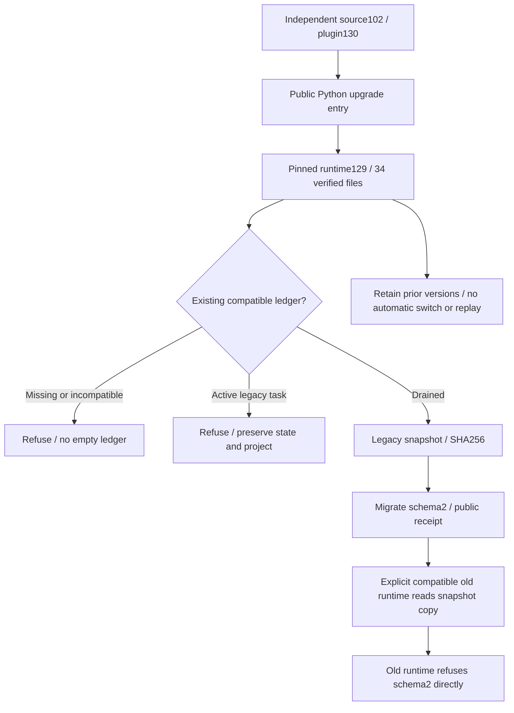
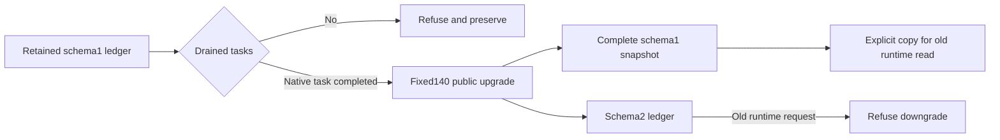

# ArtCraft fixed upgrade distribution architecture

Implementation task4.5 is complete at plugin130/source102/runtime129. Full scenario acceptance4.6 remains open;12 numbered tasks remain and complete V1 is unproven.

Source101/plugin129 rejected actual upgrade in the Python whitelist despite valid help/version discovery. Replaying immutable source101 preserved exit2/raw unsupported_cli_subcommand diagnostics, unchanged prior ledger and no installation effects. Source102 fixes all10 launchers without changing runtime129 bytes. Earlier immutable tags/assets remain with their limitation documented.

The isolated Codex host discovered64 skills; all installed trees match the fixed lock before and after use. Each of10 Art skills was copied independently and started with an empty runtime/system-only PATH using public downloads:20 version/help probes and10 actual upgrade calls on missing ledgers returned ENOENT without creating files. Source and original installed trees stayed unchanged. Advertised help alone is not command dispatch evidence.

The installed public entry verified active schema1 refusal, retained old-runtime Effect native save/reopen, drained migration, complete snapshot data equality, compatible copied-snapshot reading, incompatible old-runtime refusal and repetition without replay.34 new core files match the lock;67 prior core files remain unchanged. Four domain locks are identical. A separate installed four-domain test verified8 native outputs, frozen conflicts/reuse/new authorization and moved package. Actual absent-domain capability returns capability_missing with ledger/native preservation; this is not every missing native-command schema case.

Source203:151 passed/52 conditional skips. Plugin115:109 passed/6 conditional skips. Corresponding core CI runtime322:300 passed/22 conditional skips. Actual installed native-upgrade and four-domain integration tests each passed1. Whitelist failure, partial cold-stop and disk-full errors are retained. Only closed generated QA host caches were cleaned; receipts/logs/native projects/runtimes remain. [Evidence](evidence/fixed-upgrade-distribution130-20261009.json).

This closes4.5 implementation, fixed distribution and affected regression. Task4.6 still requires the complete AC-RT-002 scenario matrix with exact evidence and gaps;10 CLI checks or this native integration do not establish full GUI/platform/V1 acceptance. Generic Skills CLI3.16 awaits the previously requested download authority. Other domain repositories and specification systems are unchanged; OpenSpec is not archived.

## Current fixed140 verification (2026-10-09)

This section uses plugin140/source112/runtime139-runtime.1 and replaces inferred applicability from130 only within the tested scope. Two tests pass without skips, with29 public calls. Twelve genuine legacy SQLite state/lease/execution fixtures, future schema and actual directory write denial refuse unsafe upgrade while preserving original records and existing snapshots. A missing ledger remains absent.

A separate actual EffectCraft workflow creates, saves and reopens a native project under the retained schema1 runtime. Upgrade refuses while the task is active; after draining, the fixed public entry migrates with a verified complete independent snapshot. Explicit rollback reads a copied compatible snapshot under the old runtime; the old runtime refuses the new ledger. Repeated upgrade creates no extra snapshot, and native project, retained modules and snapshot digests remain unchanged.

After execution,39 fixed core files and ten complete extracted skill trees still match the immutable inventory. Verified existing caches are used; these29 calls do not requalify ten independent cold entries. They establish current ledger-boundary and actual migration applicability, not all17 named RT-002 scenarios including mode catalogs, installation concurrency and download recovery. Task4.6 and ten numbered tasks remain open.

[Machine evidence](evidence/current-upgrade140-20261009.json) includes test/proof/log digests and path-sanitized individual calls. Runtime, skill source, release tags and acceptance criteria are unchanged.
