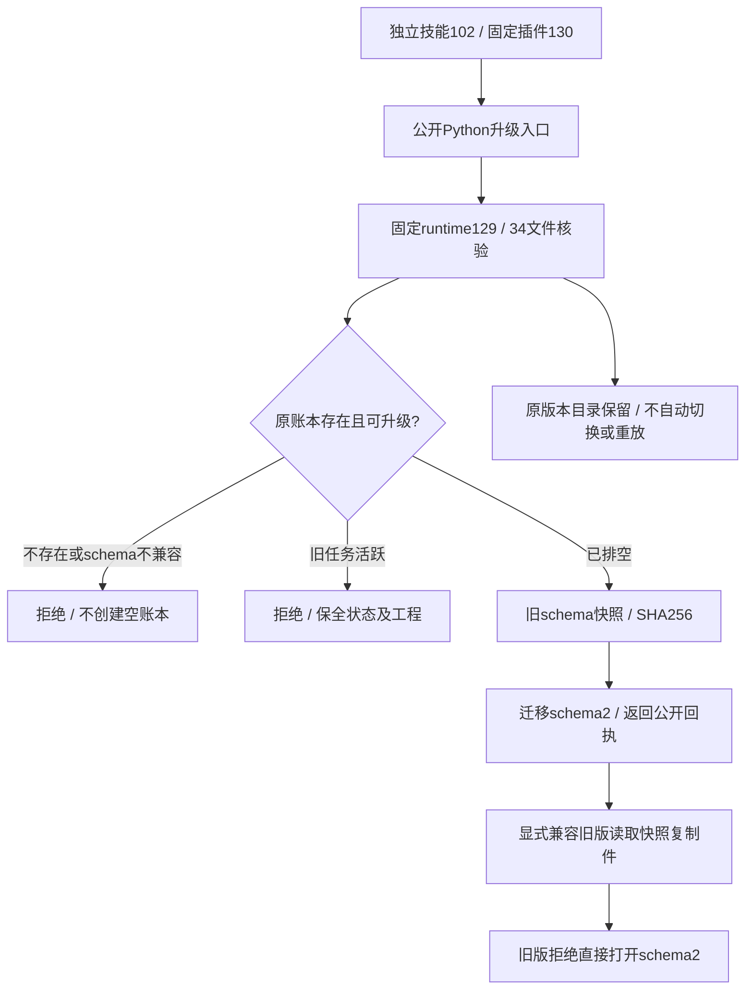
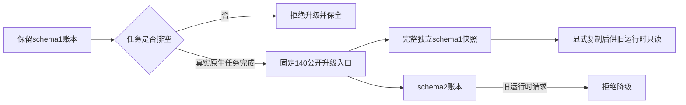

# ArtCraft 固定升级分发架构

实现任务4.5已完成，固定身份为插件130／独立源102／runtime129。完整场景验收4.6仍开放；剩余12项编号任务，完整V1未完成。

源101／插件129的实际升级被Python白名单提前拒绝，尽管帮助与版本发现正常。冻结源101重放保留了退出码2、unsupported_cli_subcommand原始诊断，原账本没有改变且没有安装副作用。源102修复十份公开启动器，runtime129字节不变；旧标签和制品保留，发布说明已标记限制。

隔离Codex宿主实际发现64个技能，安装树在使用前后均符合固定锁。十个Art技能各自复制到独立目录、用空运行时和系统PATH公开下载安装：20次版本／帮助探测及10次真实升级不存在账本的ENOENT拒绝通过；源文件与原安装未变。帮助出现命令不能替代实际调用。

实际安装公开入口完成旧schema1活跃任务拒绝、保留旧运行时执行Effect原生保存／重开、排空升级、完整快照数据比对、兼容复制件读取、不兼容旧版拒绝和重复升级不重放。34个新核心文件与锁一致，67个旧核心文件保全。四领域固定锁保持完全相同；安装副本另行完成四领域8个原生产物的冻结冲突／复用／新授权与移动包回归。实际缺失领域能力返回capability_missing，原账本和原生工程保全；此证据不推广到每种缺失原生命令schema。

源码203项：151通过／52条件跳过；插件115项：109通过／6条件跳过；对应核心的CI运行时322项：300通过／22条件跳过。真实安装升级专项1项、四领域专项1项通过。首次白名单失败、部分冷启动停止、磁盘满错误均保留；只清理已闭合QA宿主缓存，回执、日志、工程和原生运行时保留。[完整证据](evidence/fixed-upgrade-distribution130-20261009.json)。

本次完成的是4.5的实现、固定分发与受影响回归。4.6须继续对照全部AC-RT-002场景，记录逐场景当前证据与未验证项；不以10个CLI探测或本专项代替完整矩阵、GUI及其他平台验收。通用Skills CLI安装3.16仍等待已发出的下载授权。本次不修改其他领域仓库、不迁移规格体系、不归档OpenSpec。

## 当前固定140补验（2026-10-09）

本节使用插件140／技能源112／runtime139-runtime.1，替代旧130记录在本节测试范围内的版本适用性推断。两个实际测试通过、无跳过，共29次公开调用。12类旧账本状态、租约、执行停止、未来schema及真实目录拒写，均拒绝不安全升级并保持全部原记录与既有快照；不存在账本保持不存在。

另一条真实EffectCraft流程在保留的schema1运行时创建、保存、重开工程，先证明活跃任务拒绝升级，排空后从固定公开入口完成迁移。快照数据与迁移前账本一致；显式复制快照供旧运行时读取，新账本拒绝交给旧运行时。重复升级不新增快照，原生工程、旧模块和快照摘要保持不变。

执行后39项固定核心文件及十技能整树均与既有不可变发行清单一致。使用已有核验缓存，没有执行新的冷安装，也没有用这29次调用代替十独立冷入口验收。该补验证明账本边界与真实迁移路径的当前适用性，不能单独关闭包含模式目录、安装互斥和下载恢复等17个具名场景的4.6。完整V1仍有10项编号任务未完成。

[本次机器证据](evidence/current-upgrade140-20261009.json)包含测试、原始证明与日志摘要，以及经过路径脱敏的逐次调用。未改动运行时、技能源、发行标签或验收标准。
