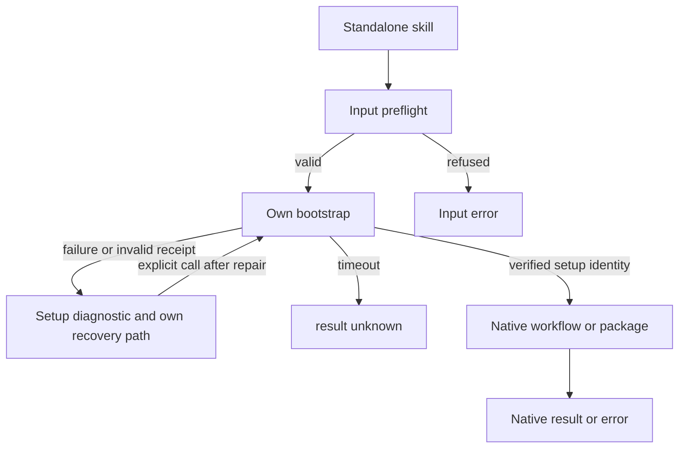

# ArtCraft scenario first-use installation diagnostics

This change implements AC-SK-003-SCENARIO-SETUP. Each independently installed skill invokes its own bootstrap from workflow/package entry points. Installation failures must remain distinguishable from native task results.

## Receipt and compatibility

The original error string remains compatible. Top-level dependencySetup and result expose recovery information; installationReceipt preserves a structured failed bootstrap reply. The bootstrapScript path is computed from the current skill rather than trusted from a returned path. Startup exceptions, timeouts, stderr-only and non-JSON failures preserve diagnostics. A zero exit with an invalid schema, nodeExecutable or entryPoint is refused before native execution.

Preflight refusal and native errors after successful installation retain their own semantics. Failed installation does not invent workflowReceipt or launch another task. Existing project bytes remain intact. No native editing is automatically retried. Repair the lock from its confirmed distribution or explicitly select another runtime-home before calling again.

## Implementation and evidence

workflow.py and package.py each wrap only the installation stage; all ten standalone skills carry the same resources. Twenty isolated copy calls and eight startup/timeout/text cases first exposed28 failures. Further checks cover malformed successful receipts, native errors and input refusal. Source regression:167 tests,129 passed,38 conditional skips.

Public cold-install evidence is recorded in docs/evidence/scenario-setup-diagnostics-20261008.json. Candidate and immutable-release acceptance remain separate. Generic Skills CLI installation, all creative scenarios, GUI, other platforms and complete V1 are not established by these checks.
