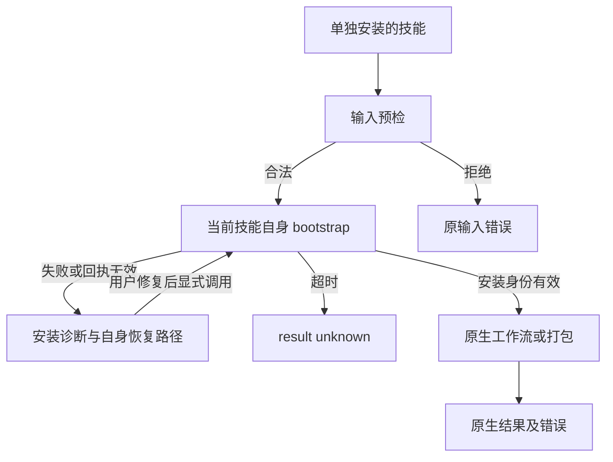

# ArtCraft 场景首用安装诊断

本变更覆盖 AC-SK-003-SCENARIO-SETUP。独立技能自身的 workflow/package 入口调用自身 bootstrap；安装失败不能伪装成已经执行的领域任务。

## 回执与兼容

保留原 error 字符串；新增 dependencySetup 和 result。安装器结构化失败对象保存在 installationReceipt；诊断的 bootstrapScript 由当前技能实际路径计算，不信任上游返回的另一安装位置。安装器启动异常、超时、stderr-only 与非 JSON 失败也有自身恢复位置。零退出但 schema、nodeExecutable 或 entryPoint 缺失／类型错误时拒绝。

输入前置拒绝与安装成功后的原生错误保持原语义。安装失败不创建虚构 workflowReceipt，不启动后续任务；已有项目及其原生工程保留。失败后不自动重放，用户显式修复锁或选新 runtime-home 后才能继续。

## 实现与验证

workflow.py 与 package.py 分别封装安装阶段，十独立技能携带相同实现。先以20个独立副本调用与8个启动／超时／文本诊断用例复现28处失败；再覆盖零退出的无效回执、原生错误与输入拒绝。源码167项回归中129通过、38条件跳过。

真实公开冷安装证据见 docs/evidence/scenario-setup-diagnostics-20261008.json。候选与固定发行的首用证据分别记录；不由此关闭通用Skills CLI、全部创作、GUI、跨平台或完整V1。
