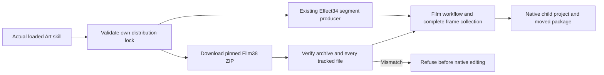

# Segmented first-use guide distribution

This change publishes the corrected ten-skill Art guide and upgrades its immutable Film skill bundle from source36 to source38. The core runtime remains dev.113-runtime.1; Effect34, Photo34 and Vector33 remain pinned to their previously verified immutable releases. The ongoing Effect runtime candidate is excluded from this distribution.

The ZIP is generated from the immutable source tag, with a matching repository-vTAG prefix and a full source-file hash inventory. The domain command index is regenerated from that same lock before all ten skills are synchronized. There are no new engine commands or core runtime changes. Film38 scripts match Film37; source36-to38 adds the ASR examples/guidance and the corrected segment guide.

The distribution regression first failed for all ten old Film bundle identities, then the lock and index were upgraded. Full source regression and plugin validation are recorded separately from actual installed cold use. [Existing fixed native HD evidence](evidence/craft-fixed-segmented-hd-refresh-20261008.json) proves Film40/Effect38/Art117 only; it cannot qualify the new immutable distribution. New Art118 installation, independent cold skills and native HD delivery must be bound to their own installed hashes before this gate closes.

The user-facing guide resolves SKILL_DIR from the actual host-loaded directory, explains typed segmented-image-sequence inputs, complete120-frame collection, explicit rational frame rates, dependency-aware revision, failure recovery and package relocation. It preserves native projects and records exchange limitations. FullV1, generic Skills CLI, GUI and creative approval remain open.
