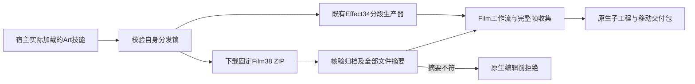

# 分段首用指南分发架构

本次发布 Art 的十项技能指南修订，将不可变 Film 技能包从 source36 升级到 source38。核心运行时保持 dev.113-runtime.1，Effect34、Photo34、Vector33 继续使用既有已验证发行。Effect 正在进行的另一批运行时候选不进入本次分发。

ZIP 从不可变源码标签生成，使用相匹配的仓库-vTAG 前缀和全部源码文件摘要。命令索引先按同一锁重建，再同步十项技能。本次不改变引擎命令或核心运行时；Film38 脚本与 Film37 相同，从 source36 到38新增ASR示例／说明及分段指南修订。

分发回归首先因十项技能的旧 Film 包身份失败，然后升级锁与索引。完整源码回归、插件静态验证与实际安装冷首用分别记录。[既有固定原生HD证据](evidence/craft-fixed-segmented-hd-refresh-20261008.json)仅证明 Film40／Effect38／Art117，不能证明新分发。Art118 的实际安装、独立技能冷安装和原生HD交付需要绑定其自己的安装摘要才能关闭本次门禁。

用户指南从宿主实际加载目录确定 SKILL_DIR，说明分段序列类型、完整120帧收集、有理帧率、依赖返工、失败恢复和迁移。原生工程保留，交换损失明确记录。完整V1、通用Skills CLI、GUI和创意验收继续开放。
