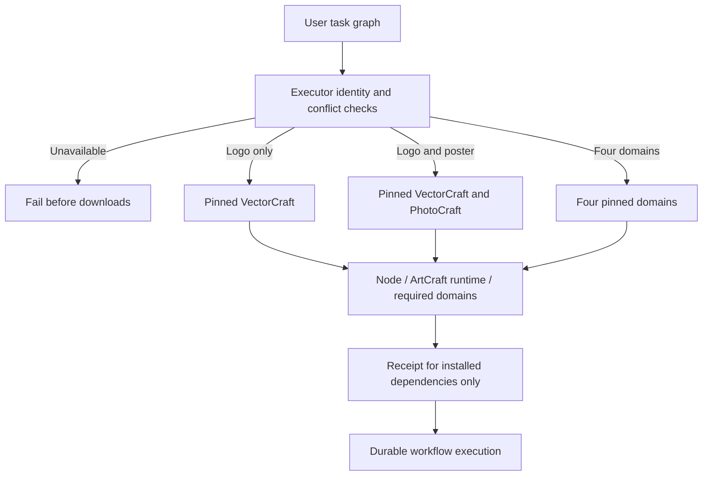

# ArtCraft task-selected setup architecture

## Boundaries and authority

Independent skill suite dev.16 selects executors through its Python setup and planning entry points. Orchestration runtime remains dev.16; domain source versions and archive hashes are unchanged. Existing OpenSpec AC-DM-002 and its SELECT scenario govern the behavior. Logo-only work must not install every domain or silently substitute a native format for an unavailable executor.

## Selection and installation

workflow.py reads pluginId or runtimeIdentity.pluginId, refusing conflicts and unknown executors, including unregistered Jianying, before downloading dependencies. Domains are deduplicated in stable order. External Video Factory does not imply installation of all four domains; its public plugin and media tools still require explicit registration.

Repeatable bootstrap --plugin flags select domains; --runtime-only installs Node and ArtCraft without domain tools. These options are exclusive. Duplicate selections fail before Node installation. Omitted selection retains the historical full-install default. setup.py validates selection type, uniqueness and support again, validates the complete distribution lock structure, and downloads only selected bundles before invoking their public bootstrap entry points.

## Receipts and incremental reuse

Receipt skills and bundleHashes contain only dependencies actually installed and verified for this invocation. They cannot claim unavailable tools. Version/digest-keyed installations are reused when PhotoCraft is added to an existing VectorCraft project. Unchanged input, plan and runtime identity preserve the Logo task ID; unchanged old artifacts retain their digests. Repeating the same revision does not replay tasks or allocate another revision budget.

Node, native CLI binaries and TypeScript execution runtime are unchanged. The four-domain example still selects all four domains. CLI discovery, status, packaging and verification install only the orchestration runtime. Direct run continues to require explicit registered domain runtime identities; missing tools are not substituted.

## Verification and remaining work

tests/test_selected_setup.py covers actual selected receipt contents, runtime-only mode, full-install compatibility, invalid/duplicate/unknown selection, conflicting node identities, and isolated default-public-download Logo creation with incremental poster creation. It verifies unchanged files/tasks and unavailable Jianying rejection before installation. These tests do not establish other platforms, GUI operation, model dispatch or complete creative acceptance. docs/evidence/selected-domain-first-use.json records measured validation and publication scope.
