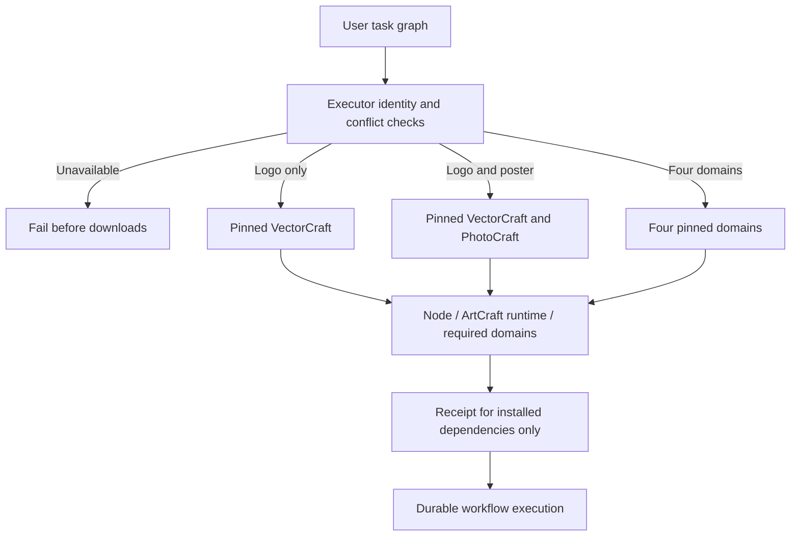

# ArtCraft task-selected setup architecture

## Current fixed126 implementation evidence

Core tests and implementation tasks6.4/6.5 are complete;full acceptance6.6 remains open. Versions are plugin126/source98/runtime126-runtime.1,with domain identities in host-acceptance-art126.lock.json. Only tests and documentation change;no duplicate release is created.

Three public installation-boundary tests fail on historical commit53a26b4f1884cba0b12de1f4bc61b30572e08f1f: unknown Jianying and conflicting identities reach the installer,and a Vector plan lacks selection flags. All three pass now. This is a historical behavior replay performed after implementation,not original TDD history;no new product fix is claimed.

An individually copied installed planning skill uses public downloads into an empty cache:Vector only first,then incremental Photo for a poster. Old Logo task/delivery and all Vector native/skill file hashes remain unchanged. Repeating the graph reuses task IDs and budget. Queries/package operations do not add Film or Effect. A separate empty verification cache installs only Node and Art runtime,with no domains. Jianying is refused before downloads without installation,execution or fcproj substitution.

| Boundary | Implementation and evidence |
|---|---|
| Executor selection | required_plugins precedes setup and deduplicates identities;setup records installed dependencies only.Three boundary tests and one actual public cold-install case pass. |
| Native format/capability binding | assessBrief and WorkflowEngine.validate reject substitution/unregistered factories;setup binds live CLI catalog,bundle and scripts;publicSkillFactory forbids payload-selected executors.Current Brief acceptance remains separately bound. |
| Command component and DAG | Fixed index binds the release lock;domain_commands.py calls only the chosen domain's public commands.py;the factory locks gateway/parser/catalog/native results.Component receipts remain separate from DAG gates. |
| ASR and domain scenes | Fixed bundles delegate Whisper,Vector appearance,Effect expression and Photo mask capabilities.The current lock/adapter paths exist;historical specialized proofs retain their original version scope. |
| Public gateway Brief | Python/TypeScript defer only verifiable native metadata;authority,ambiguities and malformed requests still fail.Current fixed cold gateway acceptance remains part of6.6. |

The actual offline list returns2646 entries:Film666/Effect640/Photo755/Vector585.Four describes succeed without creating a runtime directory.This proves discovery/description,not2646 native executions.

Selected suite:7 passed,including6 fixture tests and1 real public cold/incremental/independent-package workflow,50.046s.Skill regression:187 total,140 passed,47 conditional skips.All33 loaded runtime files match current source,all64 installed host skill trees retain fixed identities,and ten standalone routing-resource copies match.See [current evidence](evidence/routing-implementation-fixed126-20261008.json) for arguments,exit statuses,output hashes,native child files and replay logs.

Run from the standalone skills repository with a verified installed skill and a nonexistent isolated output directory.This uses public downloads without local archive overrides:

```sh
CRAFT_SELECTED_FIRST_USE=1 \
CRAFT_SELECTED_ROOT="$ISOLATED_ACCEPTANCE_ROOT" \
CRAFT_SELECTED_SKILL="$INSTALLED_ARTCRAFT_PLAN_SKILL" \
python3 -I -B -m unittest discover -s tests -p test_selected_setup.py -v
python3 -I -B -m unittest discover -s tests -p test_routing_boundary.py -v
```

Acceptance6.6 still tracks all11 AC-DM-002-prefixed scenarios.PUBLIC-GATEWAY-BRIEF is located under the AC-DM-006 heading;this difference is recorded without ignoring or moving that scenario.Selected-install evidence does not replace a current full gateway,ASR mixed,Vector appearance,Effect expression,Photo mask or trusted/untrusted source matrix.Historical specialized results remain version-bound.macOS arm64,programmatic samples and actual public downloads are explicit boundaries.Model dispatch,GUI,other platforms,creative approval,generic Skills CLI and fullV1 are not completed here.

The following sections retain the dev.16 historical design/evidence.Current identity/status is given above.


## Boundaries and authority

Independent skill suite dev.16 selects executors through its Python setup and planning entry points. Orchestration runtime remains dev.16; domain source versions and archive hashes are unchanged. Existing OpenSpec AC-DM-002 and its SELECT scenario govern the behavior. Logo-only work must not install every domain or silently substitute a native format for an unavailable executor.

## Selection and installation



workflow.py reads pluginId or runtimeIdentity.pluginId, refusing conflicts and unknown executors, including unregistered Jianying, before downloading dependencies. Domains are deduplicated in stable order. External Video Factory does not imply installation of all four domains; its public plugin and media tools still require explicit registration.

Repeatable bootstrap --plugin flags select domains; --runtime-only installs Node and ArtCraft without domain tools. These options are exclusive. Duplicate selections fail before Node installation. Omitted selection retains the historical full-install default. setup.py validates selection type, uniqueness and support again, validates the complete distribution lock structure, and downloads only selected bundles before invoking their public bootstrap entry points.

## Receipts and incremental reuse

Receipt skills and bundleHashes contain only dependencies actually installed and verified for this invocation. They cannot claim unavailable tools. Version/digest-keyed installations are reused when PhotoCraft is added to an existing VectorCraft project. Unchanged input, plan and runtime identity preserve the Logo task ID; unchanged old artifacts retain their digests. Repeating the same revision does not replay tasks or allocate another revision budget.

Node, native CLI binaries and TypeScript execution runtime are unchanged. The four-domain example still selects all four domains. CLI discovery, status, packaging and verification install only the orchestration runtime. Direct run continues to require explicit registered domain runtime identities; missing tools are not substituted.

## Verification and remaining work

tests/test_selected_setup.py covers actual selected receipt contents, runtime-only mode, full-install compatibility, invalid/duplicate/unknown selection, conflicting node identities, and isolated default-public-download Logo creation with incremental poster creation. It verifies unchanged files/tasks and unavailable Jianying rejection before installation. These tests do not establish other platforms, GUI operation, model dispatch or complete creative acceptance. docs/evidence/selected-domain-first-use.json records measured validation and publication scope.
