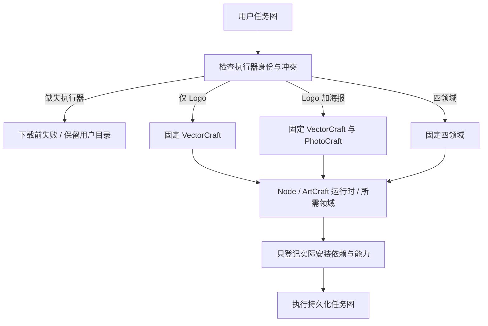

# ArtCraft 按任务图安装架构

## 边界与事实源

独立技能套件 dev.15 的 Python 安装与规划入口选择所需执行器；固定编排运行时仍为 dev.16，领域技能源版本及 ZIP 摘要保持不变。既有 OpenSpec 的 AC-DM-002 与 SELECT 场景为规范事实源。该能力解决仅做一个图形也安装全部领域工具的问题，不把未知原生工程要求转换为已有工具。

## 依赖选择与安装

workflow.py 从 pluginId 或 runtimeIdentity.pluginId 读取执行器。同节点两种身份不一致时拒绝；未知执行器（含未登记剪映）返回 capability_missing。内部领域集合按稳定次序去重；外部 Video Factory 不触发四领域安装，仍须显式登记已安装公开工具与媒体程序。

bootstrap.py 的重复 --plugin 参数选择领域，--runtime-only 安装 Node 与 ArtCraft 而不安装领域。两者互斥；重复领域在安装 Node 前拒绝。省略选择参数保持历史完整安装默认。setup.py 对选定领域列表重新检查类型、重复与支持集，始终校验完整分发锁结构，仅下载实际所需条目并运行相应公开 bootstrap。

## 回执与增量复用

安装回执 skills 和 bundleHashes 只包含本次实际核验的领域与固定编排运行时，不能声称未安装工具可用。运行时缓存按版本和摘要保存；下次追加海报节点时复用 VectorCraft 安装，增加 PhotoCraft。工作流任务身份仍由输入、计划和运行身份确定；新增领域不能使未变化的 Logo 重做。同一修订重跑复用任务，旧交付文件保持原摘要。

本次变更不修改 Node、原生 CLI 或 TypeScript 执行器。完整四领域示例会选择全部四个领域，保留原有行为。CLI 发现、状态查询、打包和验包只安装编排运行时，不触发未使用领域下载。直接 run 的领域运行身份仍由显式 registry 登记，缺失工具不会被静默补成其他执行器。

## 验证与剩余工作

tests/test_selected_setup.py 验证选择后的真实依赖回执、无领域模式、历史完整安装默认、错误类型/重复/未知选择、任务身份冲突，以及单独技能默认公开下载的 VectorCraft 冷启动、追加 PhotoCraft、旧文件/任务复用和未知剪映下载前拒绝。真实单场景用例通过不替代跨平台、GUI、模型调度或全部创作验收。证据发布到 docs/evidence/selected-domain-first-use.json，具体状态以该文件为准。
