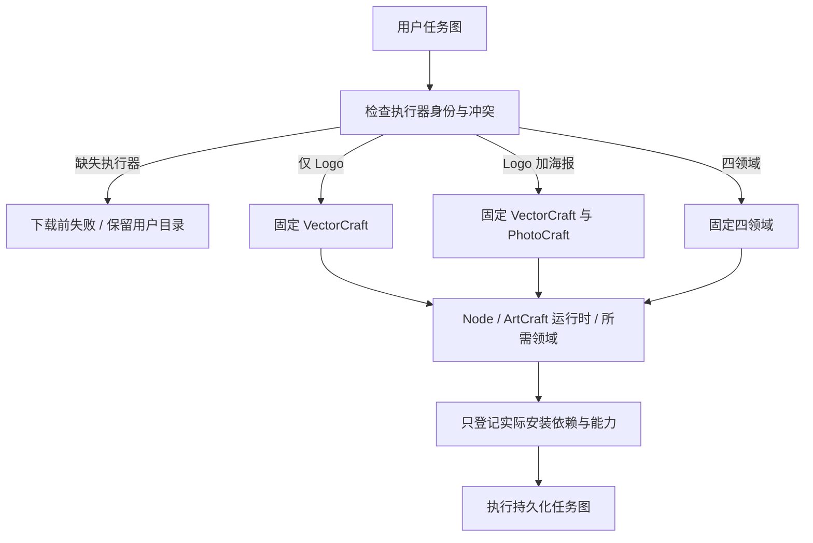

# ArtCraft 按任务图安装架构

本文保留此前检查点。任务6.6现已完成，见[当前11场景完整验收](ArtCraft-Capability-Routing-Acceptance-Architecture.zh_CN.md)。

## 当前固定126实现补证

任务6.4／6.5的核心测试与实现已完成；6.6全场景验收继续开放。固定版本为插件126／独立源98／运行时126-runtime.1，领域身份由 `host-acceptance-art126.lock.json` 固定。本次只有测试与文档变化，不创建重复发布。

三个公开安装边界测试在历史提交 `53a26b4f1884cba0b12de1f4bc61b30572e08f1f` 回放时失败：未知剪映与冲突身份到达安装器，Vector计划未携带领域选择参数。当前三个测试均通过。这是事后历史行为回放，不是原始TDD日志；没有新增产品修复。

实际宿主安装的规划技能单独复制到隔离项目，空缓存公开下载后只安装Vector；新增海报后只增量安装Photo。旧Logo任务和交付、Vector技能与原生运行时全部文件摘要保持不变。重复任务图复用任务ID和预算；打包和查询不补装Film或Effect；另一个空缓存独立验包只安装Node及Art运行时，不安装任何领域。剪映请求在下载前拒绝，无剪映安装、调用或fcproj替代。

| 实现边界 | 当前定位与证据 |
|---|---|
| 任务执行器选择 | 独立workflow.py的required_plugins先于安装器检查身份，稳定去重；setup.py只登记实际安装的依赖。3个边界测试与1个实际冷安装用例通过。 |
| 原生格式与能力绑定 | Brief的assessBrief及WorkflowEngine.validate拒绝格式替换／未登记工厂；setup绑定实际CLI目录、bundle与脚本摘要，publicSkillFactory禁止payload选择执行器。此前当前版本Brief全场景证据继续独立保留。 |
| 完整命令组件与DAG | 固定index绑定发布锁；domain_commands.py只通过选定领域公开commands.py交接；Art工厂锁定网关、解析器、目录及原生结果。组件回执与DAG交付门禁分开。 |
| ASR与领域场景 | 固定四域bundle委派真实Whisper、Vector外观、Effect表达式、Photo蒙版等能力；当前锁与通用适配器已存在，对应专项历史证明保持版本边界。 |
| 公开网关Brief | Python与TypeScript只延后可核验的原生元数据；授权、歧义及畸形请求仍拒绝。完整当前固定冷安装网关矩阵仍属于6.6。 |

当前完整离线目录查询返回2646条（Film666／Effect640／Photo755／Vector585）；四领域各一次describe成功且未创建运行时目录。这只证明查询和说明入口，不证明2646次原生执行。

本轮选择安装测试套件7项通过，其中6项为协议fixture、1项为真实公开冷安装／增量／独立验包，合计50.046秒；技能源默认回归187项中140通过／47条件跳过。33个实际运行时文件与当前源码一致，64个宿主安装技能树保持固定身份，十份独立路由资源相同。具体调用参数、退出状态、输出摘要、子工程文件摘要与回放日志摘要见[当前证据](evidence/routing-implementation-fixed126-20261008.json)。

复验从独立技能源仓库执行，显式提供已核对的固定安装技能和不存在的隔离输出路径；此入口使用公开下载，不传本地归档覆盖参数：

```sh
CRAFT_SELECTED_FIRST_USE=1 \
CRAFT_SELECTED_ROOT="$ISOLATED_ACCEPTANCE_ROOT" \
CRAFT_SELECTED_SKILL="$INSTALLED_ARTCRAFT_PLAN_SKILL" \
python3 -I -B -m unittest discover -s tests -p test_selected_setup.py -v
python3 -I -B -m unittest discover -s tests -p test_routing_boundary.py -v
```

6.6仍按全部11个AC-DM-002前缀场景核对；其中PUBLIC-GATEWAY-BRIEF位于AC-DM-006标题下，本次记录其归属差异，没有忽略或移动它。当前选择安装证据不替代完整网关四域、真实ASR混合交付、Vector外观、Effect表达式、Photo蒙版及可信／不可信源返工的当前矩阵。专项旧版本验收仍保留原范围。本机macOS arm64、程序化样本和真实下载边界明确；模型派发、GUI、其他平台、人工创作、通用SkillsCLI及完整V1没有因此完成。

以下章节保留dev.16的历史设计与当时证据；当前版本与状态以上述记录为准。


## 边界与事实源

独立技能套件 dev.16 的 Python 安装与规划入口选择所需执行器；固定编排运行时仍为 dev.16，领域技能源版本及 ZIP 摘要保持不变。既有 OpenSpec 的 AC-DM-002 与 SELECT 场景为规范事实源。该能力解决仅做一个图形也安装全部领域工具的问题，不把未知原生工程要求转换为已有工具。

## 依赖选择与安装



workflow.py 从 pluginId 或 runtimeIdentity.pluginId 读取执行器。同节点两种身份不一致时拒绝；未知执行器（含未登记剪映）返回 capability_missing。内部领域集合按稳定次序去重；外部 Video Factory 不触发四领域安装，仍须显式登记已安装公开工具与媒体程序。

bootstrap.py 的重复 --plugin 参数选择领域，--runtime-only 安装 Node 与 ArtCraft 而不安装领域。两者互斥；重复领域在安装 Node 前拒绝。省略选择参数保持历史完整安装默认。setup.py 对选定领域列表重新检查类型、重复与支持集，始终校验完整分发锁结构，仅下载实际所需条目并运行相应公开 bootstrap。

## 回执与增量复用

安装回执 skills 和 bundleHashes 只包含本次实际核验的领域与固定编排运行时，不能声称未安装工具可用。运行时缓存按版本和摘要保存；下次追加海报节点时复用 VectorCraft 安装，增加 PhotoCraft。工作流任务身份仍由输入、计划和运行身份确定；新增领域不能使未变化的 Logo 重做。同一修订重跑复用任务，旧交付文件保持原摘要。

本次变更不修改 Node、原生 CLI 或 TypeScript 执行器。完整四领域示例会选择全部四个领域，保留原有行为。CLI 发现、状态查询、打包和验包只安装编排运行时，不触发未使用领域下载。直接 run 的领域运行身份仍由显式 registry 登记，缺失工具不会被静默补成其他执行器。

## 验证与剩余工作

tests/test_selected_setup.py 验证选择后的真实依赖回执、无领域模式、历史完整安装默认、错误类型/重复/未知选择、任务身份冲突，以及单独技能默认公开下载的 VectorCraft 冷启动、追加 PhotoCraft、旧文件/任务复用和未知剪映下载前拒绝。真实单场景用例通过不替代跨平台、GUI、模型调度或全部创作验收。证据发布到 docs/evidence/selected-domain-first-use.json，具体状态以该文件为准。
