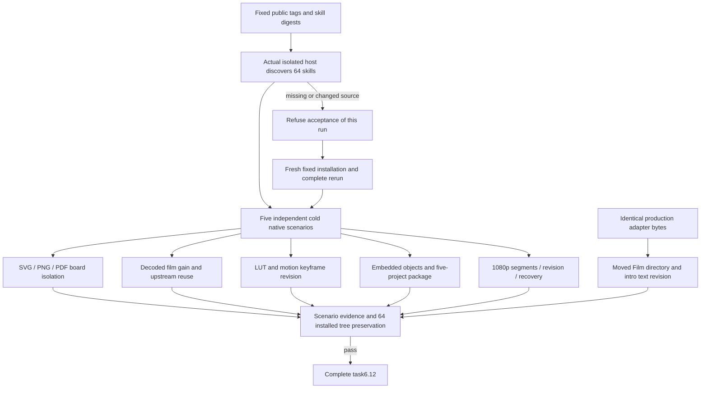

# ArtCraft seven-scenario asset version acceptance architecture

Task6.12 passes the seven current AC-DM-004 scenarios. Tasks6.10/6.11 retain their original RED/GREEN and old-review traceability evidence. Fixed identities are plugin125/source97/runtime125 on macOS arm64. [Bound acceptance evidence](evidence/selective-version-scenarios-fixed125-20261008.json). Complete V1 and other requirements remain open.

| Scenario | Current evidence and boundary |
| :--- | :--- |
| P/N | Version identity, derivation edges, historical ledger/review traceability and independent voice reuse; 47 contract tests plus the unchanged production core acceptance. Rebuilding an unrelated node fails selective assertions. |
| SVG | Distinct board dimensions/origins, rebuilt brand consumers, byte-identical unrelated SVG/PNG/PDF, native board identity and old delivery preservation, repeat task/budget reuse and moved five-project package. Fixed Vector native code supplies locking, stroke/effect and conservative container policy; Art adds no SVG rendering policy. |
| GAIN | Only Film static gain changes after four native projects exist. Independent decoding verifies -6 dB; other three tasks, clips, captions and preview stay preserved, with repeat reuse. |
| LUT | Public typed handoff and dependency lineage; motion keyframe revision preserves LUT, audio, captions, source and upstream. Invalid type/domain/extension is refused without creating a plan directory. |
| SMART | Native Photo embedded Logo replacement preserves text, background, mask and transform. Four consumers update, independent node reuses, corruption/recovery and five-project packaging pass. No persistent link or external PSD-editor fidelity claim. |
| HD | 1920×1080,24 fps,five seconds,120 frames in four segments; independent decoding, frame digests, brand revision and packaging pass. The separately permitted native adapter candidate boundary verifies moved Film directory, intro text change, background/initial transparent frame preservation, corrupt-segment refusal and task/budget recovery reuse. |

Five public cold scenarios copy one skill from the actual fixed host installation. The HD moved-text check uses identical production source bytes and fixed domain/native identities. These boundaries remain separate. All 33 production runtime files still match runtime125; every file in all64 installed skill trees matches after the final scenario. Production skills/runtime are unchanged; this maintenance requires no duplicate release.

During the first round, the older acceptance installation directory and host receipt disappeared, preventing source preservation verification. That round is not accepted. A fresh isolated host is installed inside the current acceptance directory, discovers64 skills with zero loading errors, reruns all five scenarios and verifies preservation. The disappearance cause is unknown and is not attributed to product or user.

Engineering/media consistency does not prove creative acceptance. GUI, model dispatch, human/aesthetic approval, actual generic Skills CLI installation, other platforms and complete V1 remain outside this gate.
