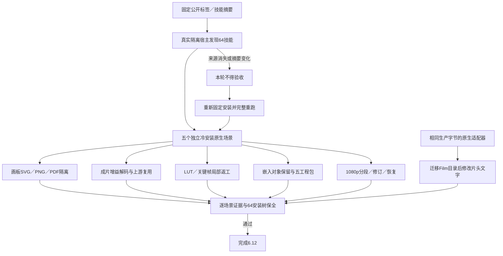

# ArtCraft 素材版本七场景验收架构

任务6.12已通过当前AC-DM-004的七场景验收；核心任务6.10、6.11保留原始红绿与旧审阅追溯证据。当前固定身份为插件125、技能源97、runtime125，验收平台为macOS arm64。[完整绑定证据](evidence/selective-version-scenarios-fixed125-20261008.json)。完整V1和其他需求仍未完成。

| 场景 | 当前证据与边界 |
| :--- | :--- |
| P／N | 版本与派生边、旧账本／旧审阅追溯、无关配音复用；47项合同测试及既有相同生产字节的核心验收。误重建无关节点将使选择性断言失败。 |
| SVG | 不同尺寸／原点画板，品牌下游更新，无关SVG／PNG／PDF逐字节一致，原生画板身份和旧交付保留，重复预算／任务幂等，五工程移动包核验。锁定对象、描边／效果与完整容器策略由固定Vector原生程序继承，Art不新增SVG渲染策略。 |
| GAIN | 已有四原生工程仅返工Film静态音轨增益；独立音频解码幅度符合-6 dB，其他三任务及片段／字幕／预览保留，重复修订复用。 |
| LUT | 公开类型绑定与依赖血缘，运动关键帧局部返工保留LUT／声音／字幕／源交付／上游；错误类型、领域、扩展名拒绝且不创建计划目录。 |
| SMART | 真实Photo嵌入智能对象替换Logo，文字／背景／蒙版／变换保持；四消费者更新、独立节点复用、损坏阻断恢复及五工程包通过。不宣称持久外链或外部PSD编辑器保真。 |
| HD | 1920×1080、24 fps、五秒120帧分为四段；独立解码与分段摘要核对，品牌修订和五工程包通过。另以规范允许的原生适配器候选边界验证移动Film目录、修改片头文字、背景／透明初帧保留、损坏段拒绝和任务／预算恢复复用。 |

五项公开冷首用从真实固定安装副本复制单个技能后执行；HD迁移文字检查使用同一生产源码字节和相同固定领域技能、原生程序身份。两种边界分别记录。所有33项生产运行时文件仍匹配固定runtime125，全部64项安装技能在最终场景之后再次逐文件核验保持不变。生产技能与运行时未改动，本次为验收测试及文档维护，不创建重复发行。

首轮原生场景执行期间，旧验收目录中的安装副本及宿主回执消失，导致来源保全无法证明。首轮整体不计通过；重新建立当前目录内的隔离宿主安装，实际发现64技能且零加载错误，五项场景全部重跑，再核验安装保全。目录消失原因未确定，不归因于产品或用户。

工程与媒体一致性不等于创作接受。本验收不关闭GUI、模型调度、人工／审美批准、通用Skills CLI实际安装、其他平台及完整V1门禁。
