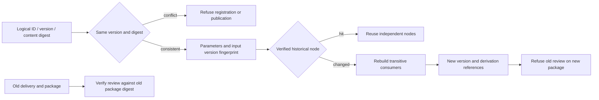

# ArtCraft selective asset version implementation architecture

Core implementation tasks 6.10 and 6.11 are verified and checked; complete contract acceptance 6.12 stays open. [Bound evidence](evidence/selective-version-implementation-audit-20261008.json). Production runtime and skill files are unchanged, retaining plugin125/source97/runtime125.

`assertArtifactVersions` distinguishes logical asset ID, version and content digest, including native, rendition, dependency and evidence references. Conflicting content for one version is refused before new workflow budget allocation or output publication. `WorkflowEngine` fingerprints parameters, input versions, runtime identity, project identity and local brief constraints. Cached files must verify before reuse. Changing Logo rebuilds its transitive consumers while independent voice retains its task. The durable ledger preserves old revision references and new tasks preserve old delivery bytes.

The original 17 version tests produce 15 behavioral failures and two passes on the fixed baseline. This audit verifies the retained RED log and exact test digest; it does not claim a new baseline run. Current targeted regression passes all 59 tests, strengthening derivation edges, old ledger/output preservation, voice reuse and repeat task/budget assertions. All 33 production files match fixed runtime125.

An actual installed independent review skill is copied alone and downloads fixed dependencies into an empty runtime through public entry points. It creates a native Vector project and moved package, records a technical observation, then changes Logo fill on a source-project copy. Logical asset ID stays stable while version and digest change. Repeating the revision reuses tasks and budget. Old project, package and review bytes remain unchanged. The old review still verifies against the old package and is refused against the new package with `review_package_stale`. Skill files remain unchanged. Feedback is explicitly a test observation; creative and human acceptance remain NOT_RUN.

The native test passes in 55.127 seconds. Independent source regression: 180 total, 137 passed and 43 conditional skips. The first native attempt used an incorrect `logo.id` reference; Boolean union returns `logo.ids`. Correcting this fixture and rerunning passes. That failure is not product RED evidence.

| Scenario under 6.12 | Audit boundary |
| :--- | :--- |
| P/N core identity, edges, voice reuse and old records | Current real-process tests and native old-review traceability; no complete creative scenario claim |
| SVG board isolation | Existing specialized evidence retained; full current fixed dependency contract still needs audit |
| GAIN static audio gain | Existing evidence retained; full mixed gain decoding not rerun here |
| LUT motion revision | Existing evidence retained; current fixed combined scenario not rerun here |
| SMART embedded objects | Existing evidence retained; current fixed combined scenario not rerun here |
| HD segmented candidate | Source candidate and fixed installed evidence remain distinct; no status promotion here |

Each native scenario and complete contract matrix must meet its own boundary. Closing the core tasks does not close 6.12, complete V1 or generic Skills CLI gates.
