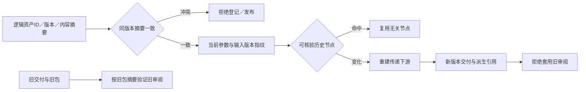

# ArtCraft 素材版本与选择性失效实现架构

核心实现任务 6.10、6.11 已完成核验并勾选；完整合同验收 6.12 继续开放。[绑定证据](evidence/selective-version-implementation-audit-20261008.json)。本次不修改生产运行时或技能文件，沿用插件125／技能源97／runtime125。

`assertArtifactVersions` 区分逻辑资产 ID、版本和内容哈希，核对原生工程、表示、依赖与证据引用。同版本内容冲突在新工作流预算分配或输出发布前拒绝。`WorkflowEngine` 以参数、输入版本、运行身份、工程身份及局部需求计算指纹；历史产物核验通过后才复用，Logo 改变使传递消费者更新，无关配音保持原任务。持久账本保留旧修订的产物引用，既有文件不被新任务覆盖。

原版本合同的 17 项测试在固定基线上有 15 项行为失败、2 项通过；本次核对原日志与测试摘要，未虚构新的红灯。当前 59 项版本／调度测试通过，补充断言新版本派生边、旧账本产物和字节保全、配音复用以及重复修订任务／预算不变。核心源码与固定 runtime125 的 33 项文件摘要一致。

实际安装的独立审阅技能复制到独立目录，从空运行时经公开入口下载固定依赖，创建 Vector 原生工程和移动交付包；记录技术观察后在源工程副本修改 Logo 填色。逻辑资产 ID 不变，版本和内容摘要更新。重复修订复用任务和预算；旧工程、旧包和旧审阅记录保持字节一致，旧审阅仍可针对旧包验证，针对新包验证时返回 `review_package_stale`。技能文件保全；观察明确为测试反馈，创作和人工接受状态仍未执行。

原生用例 1 项通过（55.127秒）；独立源默认回归 180 项中137通过、43条件跳过。首轮测试错误使用 `logo.id`，实际布尔合并结果为 `logo.ids`；修正夹具后重新通过，该首轮失败不是产品缺陷红灯。

| 6.12 场景 | 当前审计结论 |
| :--- | :--- |
| P／N 核心版本、派生边、配音复用和旧记录 | 当前本地真实进程测试与原生旧审阅追溯有证据；不代表全部创作场景 |
| SVG 画板隔离 | 既有专项证据保留；需要按完整合同核对当前固定依赖边界 |
| GAIN 静态增益 | 既有专项证据保留；本次未重新解码完整混合增益场景 |
| LUT 局部运动 | 既有专项证据保留；本次未重新执行当前固定联合场景 |
| SMART 嵌入对象 | 既有专项证据保留；本次未重新执行当前固定联合场景 |
| HD 分段候选 | 保持源码候选与固定安装证据分离；本次不提升验收状态 |

原生专项与完整合同矩阵按各自范围验收，不因核心任务勾选而关闭 6.12、完整 V1 或通用 Skills CLI 门禁。
