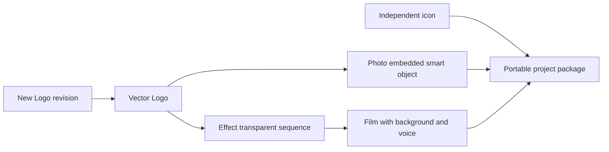

# ArtCraft Smart Mixed Architecture

> Date: 2026-10-06. Scope: independently installed Art skill, pinned Photo embedded-smart workflow, four native domains and selective revision. Status: candidate verification; fixed installed-host acceptance remains open.

## Contract and ownership

OpenSpec `establish-v1-plugin`, requirement AC-DM-004 and scenario AC-DM-004-SMART own this increment. Independent `artcraft-skills` owns executable skill resources; Art plugin vendors immutable releases. Photo source dev.10 owns the scoped smart adapter and maintained native CLI `0.2.0-craft.1`. Art runtime dev.68 is reused without a code change; Film source dev.10, Effect dev.9 and Vector dev.10 retain their identities.

The first loaded skill directory supplies scripts, examples and locks. It can be copied alone to a user/project `.agents/skills` directory or loaded from a plugin cache. No sibling skill, global Node or `/mnt/skills` path is required. macOS arm64 and Python 3.11+ remain the supported first-use platform.

## Dependency and revision flow

The smart example contains five nodes and four native domains. Initial Photo placement uses registered `asset.placeSmart`, followed by an explicit reveal-all mask. A later Logo revision binds the previous Photo output as `sourceProject`, verifies its expected native project digest, and uses `layer.smartObjects.replaceContents` on the saved layer ID. It does not recreate the poster. Title/background layer data, mask and smart transform must remain unchanged.

The Photo adapter reads registered asset bytes through scoped directory authority and saves embedded content. Collection/relink is not a persistent external linked-file promise. `.pcraft`, collected dependencies, PNG, PSD and parameter receipts remain in the child delivery; PSD export alone does not prove external-editor fidelity.

## Cache, failure and recovery

Art fingerprints include node payload, input asset versions, native runtime identity and expected source revision. Changed Logo content rebuilds Logo, poster, intro and film; the independent icon is reused. Repeating one revision preserves task IDs and budget. A corrupt sequence frame blocks reuse/downstream consumption; restoring the original frame permits verification and reuse without replay. Source deliveries and input media remain immutable.

## Verification and publication boundary

`tests/test_smart_mixed_first_use.py` uses a single copied skill and an empty runtime directory with public downloads. It verifies maintained Photo/source identities, actual smart-layer inspection, non-target layer equality, mask/transform preservation, changed Logo/poster pixels, twelve independently decoded Film frames, upstream invalidation, independent reuse, corrupt-frame recovery and five-child moved-package verification. All skill files are hashed before and after.

The old Photo dev.9 public workflow rejects `asset.placeSmart` before creating an output; the old four-domain lock also fails the poster node. Updating only the Photo bundle proves the dependency repair without an unnecessary Art runtime release.

Candidate first-use evidence is not fixed plugin installation. The next release must be vendored from an immutable Art source tag, rebuilt from five locked archives, installed in an isolated actual Codex host and rerun from the installed snapshot. Generic Skills CLI installation, model dispatch, GUI, persistent external links, external PSD editing, human creative acceptance and full V1 remain separate open gates.

Candidate gate: one native test passed in 56.444 seconds. The default source suite passed 75 tests with 26 explicit native skips. [Evidence](evidence/smart-mixed-candidate-20261006.json). Fixed installed-host verification remains open.

Fixed smart mixed acceptance (2026-10-06): Art plugin dev.70 / source dev.47 / runtime dev.68 and Photo plugin dev.11 / source dev.10 / maintained CLI 0.2.0-craft.1 pass one installed native test (64.957s), ten independent Art cold starts, all 58 installed digest checks, five fixed bundle rebuilds and four exact-commit CI runs. Logo replacement preserves the poster smart transform, mask and non-target layers; affected logo/poster/intro/film rebuild, independent work is reused, twelve film frames are decoded independently, corrupt-frame recovery and moved five-child package verification pass. [Evidence](evidence/codex-artcraft70-smart-mixed-first-use-20261006.json). Full V1, generic Skills CLI, GUI/model dispatch, persistent external links and external PSD fidelity remain open.
