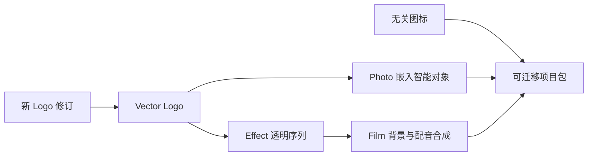

# ArtCraft 智能对象混合交接架构

> 日期：2026-10-06。范围：独立 Art 技能首次安装、固定 Photo 嵌入智能对象、四领域与选择性返工。状态：候选验收；固定插件宿主验收仍开放。

## 合同与职责

本增量由 OpenSpec `establish-v1-plugin` 的 AC-DM-004 与 AC-DM-004-SMART 场景管理。独立 `artcraft-skills` 持有可执行技能资源；Art 插件从不可变发行生成快照。Photo 源 dev.10 持有受限智能对象适配与维护版 CLI `0.2.0-craft.1`。Art runtime dev.68 没有代码改动，继续复用；Film 源 dev.10、Effect dev.9 与 Vector dev.10 保留身份。

入口使用实际加载技能目录中的脚本、示例与锁。单技能可独立放入用户／项目 `.agents/skills` 或插件缓存；不读取兄弟技能、不要求全局 Node、不使用 `/mnt/skills`。首次使用平台仍限定 macOS arm64 与 Python 3.11+。

## 依赖与修订流程

智能对象示例包含五节点与四个原生领域。首次 Photo 通过登记的 `asset.placeSmart` 放置对象，并为指定图层建立显示全部蒙版。后续 Logo 修订将旧 Photo 产物绑定为 `sourceProject`，验证预期原生摘要，在保存的图层 ID 上执行 `layer.smartObjects.replaceContents`，不重建海报。文字／背景图层数据、蒙版和智能对象变换必须保留。

Photo 适配器通过限定目录权限读取登记素材字节，保存为嵌入内容。收集／重新链接不等于持续外部文件链接承诺。子交付保留 `.pcraft`、收集素材、PNG、PSD 与参数回执；导出 PSD 不能单独证明外部编辑器保真。

## 缓存、失败与恢复

Art 指纹包含节点参数、输入资产版本、原生运行时身份与预期源修订。Logo 内容改变使 Logo、海报、片头、成片更新；无关图标复用。同一修订重复调用保留任务 ID 与预算。序列帧损坏阻断缓存复用及下游消费；恢复原字节后允许核验复用，不重放副作用。原交付及输入媒体保持不变。

## 验收与发行边界

`tests/test_smart_mixed_first_use.py` 使用单技能副本、空运行时和公开下载，核验固定 Photo 技能源／维护版 CLI、真实智能图层检查、非目标图层相等、蒙版／变换保留、Logo／海报像素变化、十二帧成片独立解码、上游失效、无关复用、坏帧恢复与五子工程移动验包。执行前后核验全部技能文件摘要。

旧 Photo dev.9 公开工作流在创建输出前拒绝 `asset.placeSmart`，旧四领域锁同样使海报节点失败。仅替换 Photo bundle 即可验证依赖修复，无须新建 Art runtime 发行。

候选首次使用不代替固定插件安装。下一发行须从不可变 Art 技能源生成快照、重建五个锁定附件、在真实隔离 Codex 宿主安装并从安装快照重跑。通用 Skills CLI 安装、模型派发、GUI、持续外部链接、外部 PSD 编辑、人类创作验收和完整 V1 仍分别开放。

候选原生门禁一项通过（56.444 秒）；默认技能源回归 75 项通过、26 项显式原生门禁跳过。[证据](evidence/smart-mixed-candidate-20261006.json)。固定宿主安装后验收仍开放。
