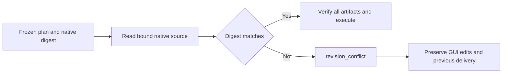

# ArtCraft source revision conflict

A plan that binds a native source digest must receive `revision_conflict` when that source changes. The source-specific check runs before generic cache/artifact checks and is repeated during adapter compilation, preparation and verification. Unbound native files, ordinary media, evidence corruption and escaping paths retain their existing refusal semantics.

An actual isolated EffectCraft desktop session used visible controls to create Comp 2 and save the registered source. The old implementation returned artifact_digest_mismatch; the candidate returns revision_conflict for the same unchanged public plan. Both compositions reopen through the native CLI. GUI bytes, original delivery, task receipt and budget remain intact. Four-domain unit coverage includes native and rendition primary artifacts, cached upstream sources and ordinary corruption refusals. Runtime regression:571 passed,25 conditional skips.

[Hashed evidence](evidence/source-revision-candidate-20261009.json). This is candidate evidence, not a new fixed installation or full single-writer acceptance. OpenSpec tasks4.6 and5.3 remain open; no V1 declaration or archive.
