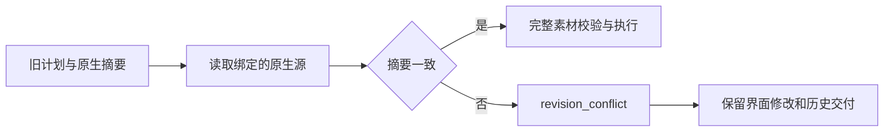

# ArtCraft 源工程版本冲突

旧计划绑定原生源摘要后，源工程实际版本变化必须返回 `revision_conflict`。版本检查先于通用缓存与素材校验，并在适配器编译、prepare、verify 时重复核验。未绑定的原生文件、普通素材、证据损坏与越界路径保留原有拒绝语义。

真实隔离 EffectCraft 桌面会话通过可见控件新建 Comp 2 并保存已登记源工程。相同公开旧计划在修改前实现返回 artifact_digest_mismatch，候选实现返回 revision_conflict。两个合成都能通过原生 CLI 重新打开；界面保存的文件、历史交付、任务回执和预算保持不变。四领域回归覆盖原生主产物、渲染主产物、缓存上游源，以及普通素材损坏。运行时回归571通过、25条件跳过。

[摘要证据](evidence/source-revision-candidate-20261009.json)。该证据属于候选代码，不代表新固定安装或完整单写入者验收。OpenSpec 4.6、5.3继续开放，不宣告V1、不归档。
