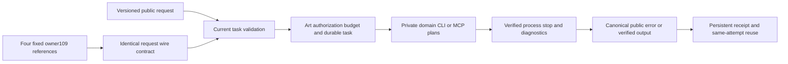

# ArtCraft public task protocol qualification

AC-CP-001 qualifies on macOS arm64 for immutable plugin140 / independent source112 / runtime139-runtime.1. All seven named scenarios have evidence and task1.3 completes. Ten numbered tasks and full V1 remain open. No runtime or installed skill distribution bytes changed; existing release tags remain immutable.

## Consumer compatibility

Pinned Film41, Effect38, Photo38 and Vector37 plugin authority references all point to Art owner109. Their pinned skill sources match the four versions actually selected by the Art distribution: Film38, Effect34, Photo34 and Vector33, with exact source commits. Every referenced owner file is rehashed from its immutable Git object. The task request schema is byte-identical to the current schema, and owner109 already names all eight canonical public error codes, including budget_exhausted.

Nine actual persisted native task requests across the four selected domains validate against their historical request contracts. Sixteen deliberate version/core/runtime/budget drifts refuse. This establishes the wire/request compatibility basis; a fixed reference by itself is not execution proof. Later spec additions refine canonical budget refusal, wrapper errorDetail and stopped-child error consumption. Those behaviors are supplied and tested at the current Art-owned public integration boundary.

The domain helpers consume private CLI/MCP plans compiled by Art; Art owns public task validation, authorization, budget accounting, supervision and receipts. This qualification covers that actual integration path and the selected immutable source versions. It does not certify newer domain checkouts, standalone domain harnesses or old artifact-schema consumers.

## Scenario evidence

| Scenario | Current evidence |
| :--- | :--- |
| P contract | Required fields, payload/runtime/plan binding; nine real native requests; durable receipt fields and technical readiness |
| N idempotency | Scoped conflicts, reopen/cross-process ownership and actual same task/attempt/budget reuse |
| V upgrade | Unknown protocol/core fields and missing fields refuse before allocations; historical schema compatibility |
| A authorization | Actual fixed native execution in scope; owner mismatch before registration; trusted callback gates claim/launch |
| OWN-FIELDS | Prototype-name core fields refuse without side effects; versioned payload data remains extensible |
| WORKFLOW-RECEIPT | Current public status/reuse/input/revision/authorization refusal; canonical repeated budget rejection; ten fixed wrapper entries |
| NATIVE-ERROR | Four domain identities × nine codes in real OS-child failures; ambiguity bounds; four actual native post-save faults and no replay |

Eight test files execute164 unique fixed-core targets with no skips or failures. Ten script trees extracted from the actual immutable plugin ZIP execute120 wrapper subcases in two test methods; these are injected entry-point tests, not native rendering tests. Four real native saves are separately subjected to a controlled malformed reply: original retained stages and files survive, each native project reopens, consumers block, and task/attempt/budget remain unchanged without replay.

Two additional copied fixed-skill native workflows verify durable receipt/status/reuse and two revision-budget refusals. The refusals expose budget_exhausted while preserving legacy budget_exceeded: revisions, eight ledger tables and original native files. All use explicit existing verified native caches; no new cold/host qualification is claimed. Current skills source regression:215 tests,162 passed,53 conditional skips.

## Evidence integrity and limits

The [machine qualification](evidence/ac-cp-001/qualification140-20261009.json) binds all seven scenarios,39 immutable core files, ten unchanged skill trees, source/proof/log digests, selected consumer commits and actual request hashes. Current native requests from the prior fixed140 dynamic run are reused as unchanged retained evidence; the receipt, budget and four post-save-fault workflows were newly executed for this qualification.

The first core invocation returned success but ran only39 present tests while requested files were absent. It is retained and excluded from the164-target result; all required test files were copied and fingerprinted before the complete156+8 runs. The native fixture's historical override label says working-tree-candidate; the executed39 core files are independently checked against the immutable ZIP, and the raw proof is not relabeled.

The old owner109 reference is preserved. Only the task spec's non-normative Purpose status is updated after verification; its request schema and behavioral requirements are unchanged. Full V1, generic Skills CLI installation, unresolved Vector mode catalog ambiguity, current host/release gates, permissions/secrets qualification, GUI/model dispatch/creative review and other platforms retain their separate acceptance boundaries.
