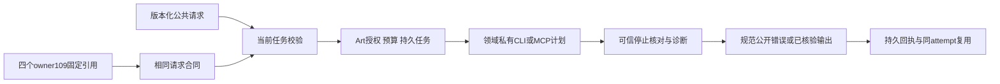

# ArtCraft 公共任务协议验收

AC-CP-001在macOS arm64、不可变插件140／独立技能源112／runtime139-runtime.1范围内完成验收。7个具名场景均有证据，任务1.3完成；10个编号任务及完整V1保持开放。本轮未修改运行时或已安装技能分发字节，保留现有不可变发行标签。

## 消费者兼容性

固定Film41、Effect38、Photo38、Vector37插件的协议所有者引用均指向Art owner109。它们锁定的技能源与Art实际选择的Film38、Effect34、Photo34、Vector33及源提交一致。每个引用文件均从不可变Git对象重新核验摘要。任务请求schema与当前版本字节相同，owner109已经定义包括budget_exhausted在内的8个规范公开错误码。

四领域9个实际持久任务请求通过各自历史请求合同校验；16个刻意构造的版本／核心字段／运行时／预算漂移均拒绝。这建立请求兼容依据，固定引用本身不当作执行证明。后续规范增量细化预算规范拒绝、包装入口errorDetail以及已停止子任务的错误消费，这些行为在当前Art负责的公开集成边界实现并验证。

领域助手消费Art编译的私有CLI／MCP计划；Art负责公共任务校验、授权、预算、监督和回执。本验收覆盖这条实际集成路径及选定不可变技能源，不替领域仓最新检出、独立Harness或旧素材schema消费者背书。

## 场景证据

| 场景 | 当前证据 |
| :--- | :--- |
| P合同 | 必填字段、payload／运行时／计划绑定；9个真实请求；持久回执字段与技术就绪状态 |
| N幂等 | 分区冲突、重开／跨进程占用；实际同任务／attempt／预算复用 |
| V升级 | 未知协议／核心字段及缺失字段在登记前拒绝；历史请求schema兼容 |
| A授权 | 当前固定原生执行；所有者不符在登记前拒绝；可信回调控制claim与启动 |
| OWN-FIELDS | 原型同名核心字段拒绝且无副作用；版本化payload保持可扩展 |
| WORKFLOW-RECEIPT | 当前公开状态／复用／输入／修订／授权拒绝；两次预算规范拒绝；十个固定包装入口 |
| NATIVE-ERROR | 四领域身份×9错误码的真实OS子进程失败；歧义边界；四项真实原生保存后故障与不重放 |

8份测试执行164个不同固定核心目标，零失败、零跳过。从实际不可变插件ZIP提取的十技能脚本树在2个测试方法中执行120个包装子用例；这是注入式入口测试，不冒充原生渲染。四次真实原生保存另注入格式损坏回复：原保留暂存与文件不变，各工程可重开，下游阻断，任务／attempt／预算保持且不重放。

另两条复制固定技能的原生流程核验持久回执／状态／复用及两次修订预算拒绝。公开错误为budget_exhausted，保留兼容字符串budget_exceeded: revisions，8张账本表与原生文件不变。均显式使用既有核验缓存，不声称新的冷安装／全宿主资格。当前技能源回归215项，162通过、53条件跳过。

## 证据完整性与边界

[机器验收记录](evidence/ac-cp-001/qualification140-20261009.json)绑定7场景、39个不可变核心文件、十技能未变树、源码／证明／日志摘要、固定消费者提交及真实请求摘要。9个真实请求复用此前固定140动态流程中未变的持久记录；回执、预算及四领域保存后故障流程为本轮新执行。

首次核心调用虽退出成功，但所指定文件有缺失，实际只运行39个现存测试。保留该结果且不计入164项；显式复制并核对必需测试文件后，完整156+8通过。原生测试夹具的历史override标签写作working-tree-candidate，实际执行的39个核心文件另与不可变ZIP逐项相等，不改标原证明。

保留owner109固定引用；核验后仅更新任务规范Purpose中的非规范性状态句，请求schema及行为要求未变。完整V1、通用Skills CLI安装、Vector模式目录歧义、当前宿主／发行门禁、权限／秘密验收、GUI／模型调度／创作及其他平台继续分别验收。
