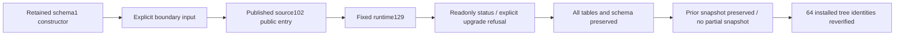

# ArtCraft Fixed Upgrade Boundary Acceptance Architecture

Task4.6 remains open. This adds public-entry boundary evidence for plugin130/source102/runtime129 without changing released runtime or skill bytes.

The retained genuine schema1 runtime constructs each database; controlled SQLite state, lease and execution inputs are then set explicitly. The installed artcraft-use public Python entry makes24 calls:11 readonly legacy status queries,12 upgrade refusals and1 nonexistent-ledger refusal. Cases cover planned, ready, running, reconciling, cancel_requested, verifying, unknown state, residual lease, prepared execution, unconfirmed stop, future schema and actual directory write permission denial. Snapshot failure uses OS permission denial, without replacing production methods. Every refusal preserves the complete schema and all table data plus prior snapshot, and leaves no partial snapshot. All64 fixed installed skill trees are reverified.

These are controlled database boundary inputs, not12 native task executions. Actual native drain, migration and explicitly copied compatible rollback evidence remains in the [fixed distribution acceptance](ArtCraft-Runtime-Upgrade-Distribution-Architecture.md).

[Boundary evidence](evidence/fixed-upgrade-boundaries130-20261009.json) binds test and raw receipt digests. Raw arguments and outputs stay in local isolated QA artifacts; published evidence has no personal absolute paths. Explicit environment enables the installed test; ordinary CI discovers and skips it.

The [14-scenario audit](evidence/runtime-upgrade-scenario-audit130-20261009.json) routes every named AC-RT-002 scenario and identifies remaining checks. Historical evidence must be matched to unchanged current relevant bytes and its actual clause coverage before reuse; changed or insufficient evidence requires new verification. No scenario is closed by this routing list. Missing native command schemas, runtime modes, concurrent installation and historical distribution clauses still need coverage audits. Task4.6, full V1 and other-platform acceptance remain open.

Historical reference paths in the mirrored matrix belong to the plugin repository; each row includes its immutable full URL.
