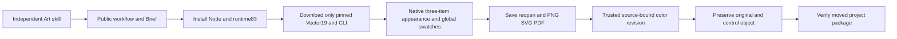

# ArtCraft Vector appearance distribution architecture

Each independent Art skill pins Vector source19, retaining all585 commands, verbatim parameters and usage recipes; runtime83 remains unchanged. Every skill owns the DAG example, source revision plan and guide. Catalog usageRecipes paths resolve against the selected domain skillRoot returned by installation, not against the Art root.

Native calls retain live enabled and selection checks. Art binds native project digests, assets, exchange loss and child results. sourceProject is constrained by the prior trusted artifact, externalInputs root and expectedRevision. New references come from the immutable Vector tag; all five distribution bundles rebuild against the lock.

The public source candidate starts from an empty runtime and passes real native creation, idempotence, source revision and moved-package verification. Target pixels/gradient paint change; control object, geometry, IDs, top fill and original delivery remain intact. SVG contains a gradient; PDF validation is header-only. Regression:118 total,89 passed,29 optional skips. [Candidate evidence](evidence/art-vector-appearance-candidate-20261007.json). Ten fixed installed entries and updated mixed delivery remain pending. Exhaustive commands, GUI, PDF visual fidelity, model and full V1 remain open.

Fixed release verification: Art86/source59/runtime83 and Vector21/source19 pass ten Art plus twelve Vector independent installed cold appearance/source-revision cases; all58 installed identities are unchanged. One additional four-domain mixed case verifies five native children, four Logo consumers, unchanged icon reuse, captions/audio and moved packaging. Four Art tag CI checks, both exact public source ZIPs and all five locked bundle rebuilds pass. [Evidence](evidence/codex-art86-vector-appearance-first-use-20261007.json).
