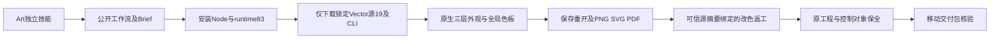

# ArtCraft Vector 外观分发架构

Art独立技能锁定Vector技能源19，继承585项完整命令目录、参数原文和场景引用；runtime83保持不变。每项技能自身携带完整DAG示例、源返工计划和指南。`usageRecipes`相对于安装回执返回的领域skillRoot解析，不能相对于Art目录解析。

领域原生调用在实时enabled及选择状态下执行。Art绑定原生工程摘要、资产清单、交换损失和子工程结果；sourceProject由此前的可信artifact、externalInputs.root和expectedRevision约束。所有新增引用来自不可变Vector标签，五个分发包按锁重建通过。

候选公开入口从空运行时下载并执行真实创建、幂等重复、源工程返工及移动包核验；目标PNG像素与渐变paint改变，控制对象、几何、ID、顶层填充和原交付保全。SVG含渐变，PDF仅文件头核验。118项回归：89通过，29明确可选跳过。[候选证据](evidence/art-vector-appearance-candidate-20261007.json)。十项固定安装入口与更新混合交付待验证；全量命令、GUI、PDF视觉、模型、完整V1仍开放。

固定发行验证：Art86／源59／runtime83与Vector21／源19，十项Art及十二项Vector实际安装技能分别从空运行时公开安装并执行外观创建和源返工；58安装身份不变。额外一项四领域混合任务核验五子工程、Logo四消费者更新、独立图标复用、字幕音频与移动包。四项Art标签CI、两个公开源ZIP与五分发包重建通过。 [Evidence](evidence/codex-art86-vector-appearance-first-use-20261007.json).
