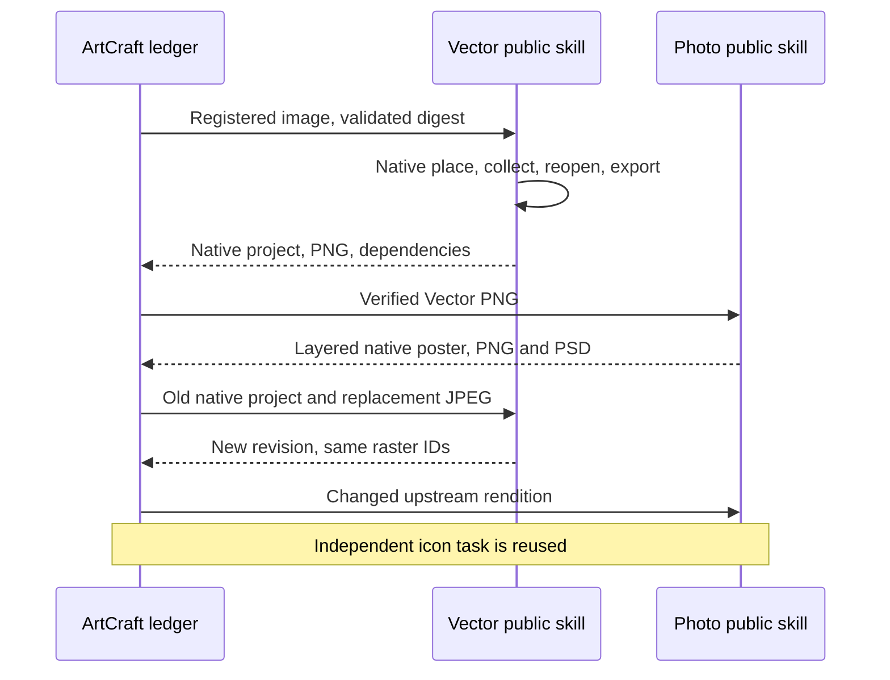

# ArtCraft Vector Assets Architecture

## Authority and candidate boundary

AC-DM-007 in the existing OpenSpec change owns logical VectorCraft asset handoff. Skill source dev.42 pins published runtime dev.60 and VectorCraft source dev.10. The previous full plugin dev.59 remains immutable; full plugin dev.61 installation is verified separately.

## Input and execution contract

Models supply assetBindings with names and artifact IDs, never machine paths or inline plan.assets. publicSkillFactory verifies all registered input bytes, derives --asset arguments and pins the interpreter, native executable and skill files through launcher identity. sourceProject is another registered artifact and must match expectedRevision and its manifest.

## Verification and revisions

The former unconditional Vector asset rejection is removed only because the independent workflow now implements the public asset contract. New and inherited collected files are rehashed. For asset.replace, the new input must occur in one explicit replacement mapping and its collected digest must appear under the old alias. Missing, unbound, duplicated or mismatched inputs do not become accepted lineage.

Result artifacts retain sourceRefs, nativeProjectRef, lossReportRef, manifest evidence and collected dependency references. Source revision is preserved rather than overwritten. A changed asset invalidates consumers through actual input hashes; unrelated nodes can reuse only verified prior outputs. Replay of the same plan must not allocate extra native tasks.

## Source-candidate acceptance

`test/public_skill_adapter.test.ts` first failed on skill_assets_unsupported, then verifies public argv and unbound/path rejection. `test/vector_asset_workflow.test.ts` runs actual current Vector/Photo scripts: supplied PNG, collected native dependency, layered poster, JPEG source replacement, changed output pixels, reuse of independent icon, preservation of all old package hashes and same-plan replay. This is not a substitute for a newly installed fixed ArtCraft skill.

Evidence: [candidate verification](evidence/vector-assets-candidate-20261006.json). New distribution locks, immutable source/runtime/plugin releases, installed-host first use, complete four-domain creative acceptance and model/GUI gates remain open. Jianying adaptation remains outside ArtCraft.

Public cold candidate acceptance now passes with runtime dev.60, Vector source dev.10 and Photo source dev.9 (1 native mixed test, 29.988s). Photo image-only font preconditions are fixed in its independent source. Fixed full-plugin installation remains pending. [Evidence](evidence/vector-assets-public-candidate-20261006.json).
