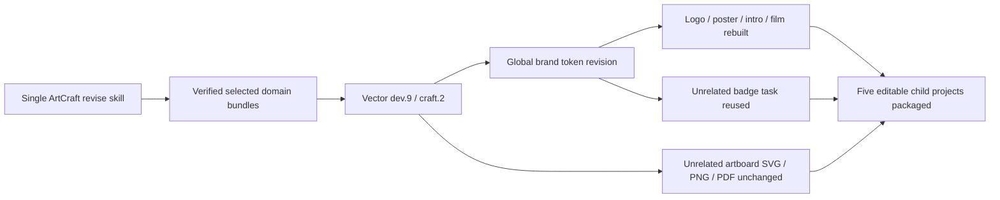

# ArtCraft mixed brand and stable vector assets

The previous fixed Vector bundle dev.7 changed an unrelated artboard SVG after a brand-token revision. Upgrading to dev.8 removed that SVG change, but real mixed execution crossed seconds and exposed PDF date drift. The repaired dependency is immutable Vector skill dev.9 / native CLI 0.2.0-craft.2. [Original failure](evidence/mixed-vector-svg-pdf-failure-20261006.json), [PDF failure](evidence/mixed-pdf-date-failure-20261006.json).

All ten skills carry the same updated distribution lock. The existing ArtCraft runtime dev.48 remains byte-identical; only the Vector skill bundle changes, using its complete public Git ZIP without rewriting archive bytes. Node and other native domain versions remain individually locked. The deterministic builder reproduces all five locked bundles.

A single copied revise skill cold-installs public runtime/domain packages, creates five native projects, revises the global brand swatch across different-sized/offset artboards, rebuilds four consumers and reuses the independent badge. Unrelated SVG/PNG/PDF bytes, board identities, source projects, original delivery and provided voice stay unchanged; consumer PNGs change, a repeat reuses tasks/budget, and the package verifies five children. Both contract/live tests pass in 50.356 seconds. The source suite passes 66 tests with 18 explicit live skips. [Evidence](evidence/vector9-brand-mixed-first-use-20261006.json).

Native PDF dates bind to the original document or a hash-bound initial-delivery record; actual native revision history stays editable. Unknown paint bounds and cross-board containers remain conservative. This does not imply all compound members can export independently. Fixed ArtCraft plugin dev.50 first use is still pending; task 6.33 stays open until it passes. ArtCraft does not install or call Jianying.
